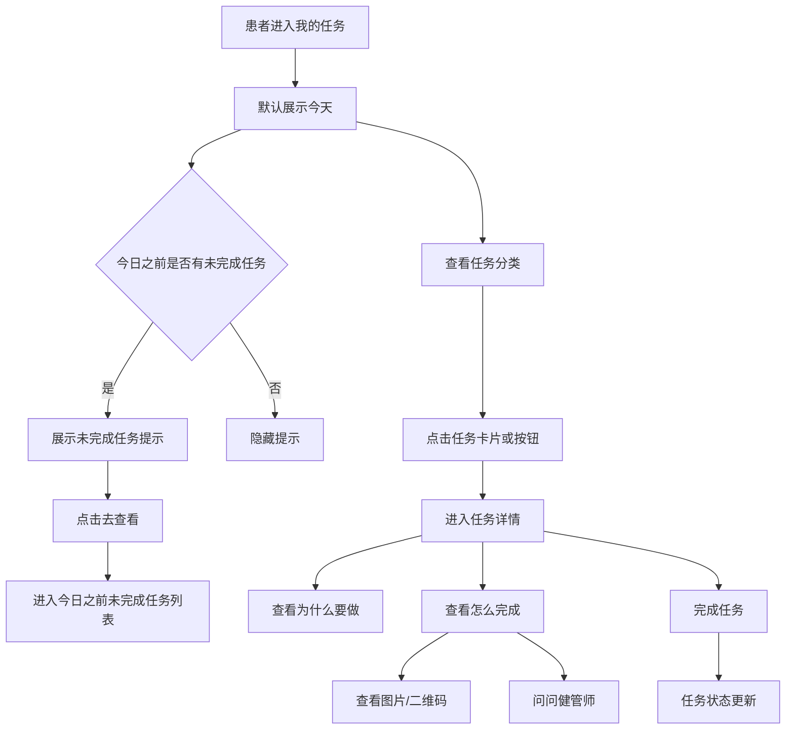

# C端「我的任务」一期 PRD

| 项目 | 内容 |
| --- | --- |
| 文档版本 | v1.0 |
| 提交日期 | 2026-05-05 |
| 所属模块 | C端小程序 / 我的任务 |
| 需求类型 | C端患者每日健康任务 |
| 需求阶段 | 一期 |
| 关联线框图 | [C端我的任务一期线框图.html](./C端我的任务一期线框图.html) |
| 重要性 | 高 |
| 紧迫性 | 高 |

## 1. 项目背景

C端当前改版主线是：

```text
健康档案 / 指标 / 饮食运动记录 / 随访
→ 管理端或AI生成方案与任务
→ 患者每日执行
→ 新数据回流
→ 影响下一轮近况分析和管理任务
```

「我的任务」是患者执行健康管理动作的核心页面。一期不做积分激励，先解决患者每天看任务、理解任务、完成任务和查看未完成任务的问题。

## 2. 一期目标

| 目标 | 说明 | 一期是否包含 |
| --- | --- | --- |
| 看今天任务 | 患者打开页面后，明确今天有哪些任务 | 是 |
| 按日期查看任务 | 支持查看今天、过去、未来日期的任务 | 是 |
| 处理今日之前未完成任务 | 提示今日之前仍有未完成任务，并提供查看入口 | 是 |
| 按优先级/难易度分组 | 用「优先处理 / 轻松完成 / 需准备」组织任务 | 是 |
| 查看任务详情 | 解释为什么做、怎么做 | 是 |
| 展示任务图片 | 支持健管师上传的操作图、说明图、二维码 | 是 |
| 问问健管师 | 统一咨询入口，用户侧不区分AI和人工 | 是 |
| 积分激励 | 完成任务得积分、奖励、权益 | 否，二期预留 |

## 3. 页面范围

| 页面 | 页面定位 | 一期范围 |
| --- | --- | --- |
| 我的任务列表页 | 患者每日任务入口 | 日期切换、未完成提示、任务分类、任务列表 |
| 任务详情页 | 单个任务执行指导页 | 任务原因、图片说明、完成步骤、问问健管师、完成动作 |
| 今日之前未完成任务列表 | 从列表页提示进入 | 展示今日之前未完成任务，按日期倒序 |

## 4. 用户价值

| 用户问题 | 页面解决方式 |
| --- | --- |
| 今天要做什么？ | 默认展示今天任务 |
| 哪个任务先做？ | 用「优先处理」突出高优先级任务 |
| 哪些任务简单？ | 用「轻松完成」承接低门槛任务 |
| 哪些任务需要提前准备？ | 用「需准备」承接复诊、报告、二维码等任务 |
| 任务为什么要做？ | 详情页展示「为什么要做」 |
| 任务具体怎么做？ | 详情页展示图片、步骤和操作入口 |
| 不懂时找谁？ | 统一入口「问问健管师」 |
| 之前漏了怎么办？ | 提示「今日之前有N项未完成任务」，点击去查看 |

## 5. 一期不做内容

| 不做内容 | 原因 | 后续方向 |
| --- | --- | --- |
| 积分、健康礼金、优惠券 | 一期先验证任务执行闭环，避免活动化 | 二期加入奖励体系 |
| 复杂任务日历 | 一期只做短日期条和前后切换 | 后续可做月历 |
| 显性AI入口 | C端用户不需要理解AI/人工分工 | 内部策略处理 |
| 任务规则说明页 | 一期页面不增加规则入口 | 后续配合积分规则再补充 |
| 多层任务筛选 | C端保持简单 | 管理端可保留复杂筛选 |

## 6. 核心流程



## 7. 任务状态

| 状态 | 定义 | C端展示位置 | 主要动作 |
| --- | --- | --- | --- |
| 今日可做 | 计划日期为今天，当前未完成 | 我的任务默认列表 | 去查看 / 去记录 / 去打卡 |
| 未来待做 | 计划日期大于今天 | 日期切换到未来日期后展示 | 查看 / 提前准备 |
| 今日之前未完成 | 计划日期早于今天，且未完成 | 顶部提示 + 未完成任务列表 | 去查看 |
| 已完成 | 患者已完成任务 | 对应日期下可展示完成态，一期可弱化 | 查看记录 |
| 已取消 | 管理端或系统取消 | 一期不在主列表展示 | 无 |

## 8. 我的任务列表页

### 8.1 页面结构

| 区域 | 是否必需 | 内容 | 交互 |
| --- | --- | --- | --- |
| 页面标题 | 是 | 我的任务 | 无 |
| 日期切换区 | 是 | 左箭头、当前日期、右箭头 | 切换前后日期 |
| 短日期条 | 是 | 最近5天日期，含任务提示点 | 点击切换日期 |
| 未完成提示 | 条件展示 | 今日之前有N项未完成任务 | 点击「去查看」 |
| 任务分类 | 是 | 优先处理、轻松完成、需准备 | 点击切换任务分组 |
| 任务列表 | 是 | 当前日期、当前分类下的任务 | 点击任务进入详情 |

### 8.2 日期切换规则

| 场景 | 展示规则 | 交互规则 |
| --- | --- | --- |
| 默认进入 | 展示今天 | 当前日期高亮 |
| 点击前一日 | 展示前一日任务 | 日期标题同步变化 |
| 点击后一日 | 展示后一日任务 | 日期标题同步变化 |
| 点击短日期条 | 展示所选日期任务 | 所选日期高亮 |
| 日期有未完成任务 | 日期角标展示小点 | 点击后进入该日期任务 |
| 日期有未来任务 | 日期角标展示小点 | 点击后进入该日期任务 |

### 8.3 未完成提示规则

| 字段 | 规则 |
| --- | --- |
| 展示条件 | 今日之前存在未完成任务 |
| 文案 | 今日之前有 {count} 项未完成任务 |
| 按钮 | 去查看 |
| 点击后 | 进入「今日之前未完成任务列表」 |
| 排序 | 按计划日期倒序，最近日期在前 |
| 不使用词 | 不使用「补记」「逾期」「漏做」作为主文案 |

### 8.4 任务分类规则

| 分类 | 定义 | 示例任务 |
| --- | --- | --- |
| 优先处理 | 对健康管理影响较大，或时效性较强 | 用药确认、胰岛素剂量确认、异常指标复测 |
| 轻松完成 | 操作简单、用时短、适合快速完成 | 血糖记录、签到、简单运动打卡 |
| 需准备 | 需要材料、环境、时间或外部配合 | 复诊资料、报告上传、扫码入群、问卷填写 |

### 8.5 任务卡片字段

| 字段 | 是否必需 | 展示说明 |
| --- | --- | --- |
| 任务图标/缩略图 | 是 | 若任务含图片，用「图」标识；否则用任务类型图标 |
| 任务名称 | 是 | 例如：确认胰岛素旋钮剂量 |
| 标签 | 否 | 仅保留有帮助的信息，如「含图示」「约1分钟」「二维码」 |
| 描述摘要 | 否 | 一期线框中弱化，可由后续UI决定是否展示 |
| 主按钮 | 是 | 根据任务动作展示：去查看 / 去记录 / 去打卡 / 查看 |

### 8.6 任务卡片按钮文案

| 任务动作类型 | 按钮文案 |
| --- | --- |
| 查看说明类 | 去查看 |
| 指标记录类 | 去记录 |
| 打卡类 | 去打卡 |
| 二维码/资料类 | 查看 |
| 未来准备类 | 查看 |

## 9. 任务详情页

### 9.1 页面结构

| 区域 | 是否必需 | 内容 | 备注 |
| --- | --- | --- | --- |
| 顶部标题 | 是 | 任务详情 | 右侧可展示来源，如「来自用药指导」 |
| 任务头部卡 | 是 | 图标、任务名称、标签、摘要 | 展示任务核心信息 |
| 为什么要做 | 是 | 原因说明、关联指标 | 解释任务价值 |
| 怎么完成 | 是 | 图片横滑、步骤说明、问问健管师 | 执行指导核心区 |
| 底部主按钮 | 是 | 我已确认 / 完成 / 提交 | 根据任务类型配置 |

### 9.2 「为什么要做」字段

| 字段 | 是否必需 | 示例 |
| --- | --- | --- |
| 原因说明 | 是 | 近期空腹血糖需要关注，确认剂量有助于保持用药稳定 |
| 关联指标 | 否 | 空腹血糖 / 用药记录 |
| 来源方案 | 不重复展示 | 若顶部已展示「来自用药指导」，本区不重复展示 |

### 9.3 「怎么完成」字段

| 字段 | 是否必需 | 规则 |
| --- | --- | --- |
| 图片/二维码 | 否 | 有则展示；无则隐藏图片区 |
| 图片展示方式 | 否 | 同尺寸横向滑动预览 |
| 图片数量 | 否 | 支持多张 |
| 二维码 | 否 | 作为同尺寸预览项展示 |
| 步骤说明 | 是 | 建议1-4步，避免过长 |
| 问问健管师 | 是 | 统一咨询入口 |

### 9.4 图片展示规则

| 场景 | 展示规则 |
| --- | --- |
| 健管师上传1张图片 | 展示1个预览图 |
| 健管师上传多张图片 | 横向滑动展示，尺寸一致 |
| 任务包含二维码 | 作为一个预览图展示 |
| 无图片 | 隐藏图片区域，不占位 |
| 点击图片 | 打开图片预览 |
| 点击二维码 | 打开二维码预览或执行扫码/识别逻辑，按小程序能力实现 |

### 9.5 问问健管师

| 项目 | 规则 |
| --- | --- |
| C端入口文案 | 问问健管师 |
| C端是否区分AI/人工 | 不区分 |
| C端是否展示AI/转人工机制说明 | 不展示 |
| 进入时上下文 | 当前任务、任务说明、图片、来源方案、关联指标 |
| 内部策略 | 可先AI解读，必要时转人工，但不在C端显性说明 |

## 10. 今日之前未完成任务列表

| 项目 | 规则 |
| --- | --- |
| 入口 | 我的任务页顶部提示「今日之前有N项未完成任务」 |
| 标题 | 未完成任务 |
| 范围 | 计划日期早于今天，且状态未完成 |
| 排序 | 计划日期倒序 |
| 分组 | 可按日期分组 |
| 任务动作 | 去查看 / 去记录 / 去打卡 / 查看 |
| 文案限制 | 不使用强惩罚语气 |

## 11. 数据字段建议

### 11.1 列表接口

| 字段 | 类型 | 必需 | 说明 |
| --- | --- | --- | --- |
| date | string | 是 | 当前查询日期，YYYY-MM-DD |
| dateText | string | 是 | 展示文案，如「今天 5月5日 周二」 |
| days[] | array | 是 | 短日期条 |
| days[].date | string | 是 | 日期 |
| days[].label | string | 是 | 周几/今天 |
| days[].dayNo | number | 是 | 日期数字 |
| days[].isSelected | boolean | 是 | 是否选中 |
| days[].hasTask | boolean | 否 | 是否有任务 |
| days[].hasBeforeUnfinished | boolean | 否 | 是否有未完成任务提示点 |
| beforeUnfinishedCount | number | 是 | 今日之前未完成任务数量 |
| groups[] | array | 是 | 任务分类 |
| groups[].groupKey | string | 是 | priority/easy/prepare |
| groups[].groupName | string | 是 | 分类名称 |
| groups[].count | number | 是 | 数量 |
| groups[].selected | boolean | 是 | 是否选中 |
| tasks[] | array | 是 | 当前分类下任务 |

### 11.2 任务字段

| 字段 | 类型 | 必需 | 说明 |
| --- | --- | --- | --- |
| taskId | string | 是 | 任务ID |
| taskName | string | 是 | 任务名称 |
| taskDate | string | 是 | 计划日期 |
| groupKey | string | 是 | priority/easy/prepare |
| status | string | 是 | today_pending/future_pending/before_unfinished/completed/cancelled |
| actionType | string | 是 | view/record/checkin/confirm/upload/open_qr |
| actionText | string | 是 | 按钮文案 |
| tags[] | array | 否 | 含图示、约1分钟、二维码等 |
| iconType | string | 否 | 图标类型 |
| hasMedia | boolean | 是 | 是否含图片或二维码 |
| summary | string | 否 | 摘要 |

### 11.3 详情字段

| 字段 | 类型 | 必需 | 说明 |
| --- | --- | --- | --- |
| taskId | string | 是 | 任务ID |
| taskName | string | 是 | 任务名称 |
| sourceText | string | 否 | 来自用药指导/饮食方案等 |
| reasonText | string | 是 | 为什么要做 |
| relatedMetrics[] | array | 否 | 关联指标 |
| media[] | array | 否 | 图片或二维码 |
| media[].mediaType | string | 是 | image/qr |
| media[].url | string | 是 | 资源地址 |
| media[].title | string | 否 | 图片标题 |
| steps[] | array | 是 | 完成步骤 |
| consultContext | object | 是 | 问问健管师上下文 |
| primaryAction | object | 是 | 主按钮动作 |

## 12. 异常与空状态

| 场景 | 展示 |
| --- | --- |
| 今日无任务 | 展示温和空态：今天暂无需要处理的任务 |
| 某分类无任务 | 展示该分类空态，不影响其他分类 |
| 图片加载失败 | 展示图片占位和重试 |
| 任务已被取消 | 返回列表时刷新，不再展示该任务 |
| 任务已完成后再次进入 | 展示已完成态，主按钮改为查看记录 |
| 未来任务不可提前完成 | 主按钮展示「查看」，不展示「完成」 |

## 13. 埋点建议

| 事件 | 触发时机 | 关键参数 |
| --- | --- | --- |
| task_page_view | 进入我的任务页 | date, beforeUnfinishedCount |
| task_date_switch | 切换日期 | fromDate, toDate |
| task_group_click | 点击任务分类 | groupKey |
| task_card_click | 点击任务卡片 | taskId, groupKey, status |
| before_unfinished_click | 点击未完成任务提示 | count |
| task_detail_view | 进入详情页 | taskId, sourceText |
| task_media_click | 点击图片/二维码 | taskId, mediaType |
| task_consult_click | 点击问问健管师 | taskId |
| task_complete_click | 点击完成/确认 | taskId, actionType |

## 14. 开发注意事项

| 项目 | 说明 |
| --- | --- |
| C端文案 | 避免「逾期」「漏做」「必须」「严重」等压迫性表达 |
| 咨询入口 | C端只展示「问问健管师」，不展示AI/人工分流说明 |
| 分类逻辑 | 分类由后端或任务生成服务返回，前端不自行推断 |
| 日期逻辑 | 前端按接口返回展示，不自行判断任务点位 |
| 图片能力 | 图片和二维码统一按 media[] 渲染 |
| 积分能力 | 一期不展示，但数据结构可预留 reward 字段 |

## 15. 待决事项

| 问题 | 建议 | 状态 |
| --- | --- | --- |
| 未完成任务列表是否独立页面 | 建议独立页面，便于后续扩展筛选 | 待确认 |
| 已完成任务是否在当前页展示 | 一期可不作为主路径，后续可加「已完成」入口 | 待确认 |
| 未来任务是否允许提前完成 | 按任务类型配置 | 待确认 |
| 二维码识别能力 | 取决于小程序技术能力和业务场景 | 待技术确认 |
| 积分激励二期规则 | 一期只预留，不设计 | 待二期 |
