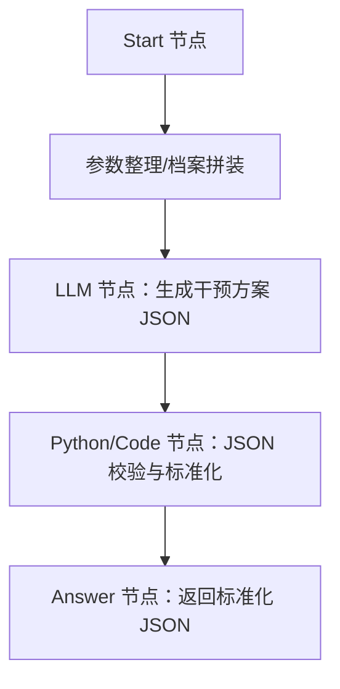

# 项目实现介绍

## 项目目标

通过 Dify 搭建健康处方生成工作流，根据患者档案信息和健管师输入的方案要求，由大模型节点生成结构化干预方案 JSON，再交由 H5 页面模板渲染为患者可阅读的健康干预方案页面。

## 工作流输入

| 输入项 | 来源 | 说明 |
| --- | --- | --- |
| 方案目标和额外要求 | 前端页面录入 | 健管师本次希望重点解决的问题、风格要求、特殊约束 |
| 额外补充信息 | 前端页面录入 | 本次生成需要临时补充但不一定已结构化入档的信息 |
| 基础档案 | 当前档案 | 患者基础身份信息、性别、年龄等 |
| 专病档案 | 当前档案 | 慢病诊断、专病标签、病程相关信息等 |
| 随访记录 | 最近1年 | 随访结论、依从性、异常反馈、管理建议 |
| 指标记录 | 最近1年 | 血糖、血压、体重、BMI、血脂等监测指标 |
| 饮食记录 | 最近1年 | 饮食习惯、结构特点、风险问题、改善情况 |
| 运动记录 | 最近1年 | 运动类型、频次、时长、强度、执行障碍 |
| 取药记录 | 最近1年 | 用药领取情况、可能反映依从性和治疗连续性 |
| 控制目标 | 当前生效 | 当前正在执行的个体化指标目标和管理目标 |

## 工作流输出

工作流最终输出一份结构化干预方案 JSON，推荐字段结构见：

- `intervention-plan-data-contract.md`
- `schema/intervention-plan.schema.json`

## 推荐实现分层

## LLM 节点职责

- 综合分析患者当前档案、最近1年管理记录、当前控制目标和本次额外要求。
- 生成面向患者可执行、健管师可审阅修改的干预方案内容。
- 严格输出约定 JSON 结构，不输出 Markdown、解释文字或 HTML。

## JSON 标准化节点职责

- 校验 LLM 输出是否为合法 JSON。
- 补齐缺失顶层字段和数组字段。
- 将 `importance` 统一约束为 `重点执行` / `常规建议` / `补充建议`。
- 对空文本做兜底，避免 H5 模板渲染异常。

## H5 渲染说明

当前 H5 demo 位于 `../干预方案H5demo`，这些页面展示的是同一份 JSON 数据在不同版式下的患者端视觉呈现。

后续正式接入时，建议将 demo 中内置的 `planData` 替换为服务端/工作流返回的标准化 JSON，或改造成 Jinja2 模板直接渲染。

## 历史资料

`旧版方案参考` 目录保留了前期两套 Dify 设计思路和旧版页面参考文件，方便对照追溯，不作为当前主实现目录。
