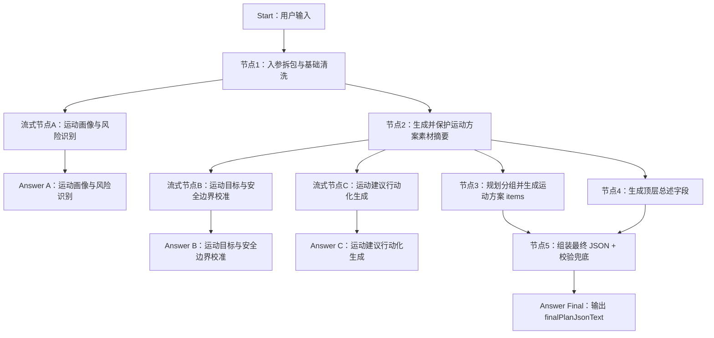

# DIFY工程-AI干预方案-运动方案-Chatflow流式版

## 工程定位

本工程是在 `DIFY工程-AI干预方案-运动方案-驼峰版` 基础上规划的 Chatflow 流式体验版。目标是在保留原有标准化运动方案 JSON 产出的同时，让前端在等待生成期间持续展示阶段性分析内容，让用户感知到系统正在按“运动画像识别、目标与安全校准、运动建议行动化生成”的流程完成方案。

本版本控制为 3 个用户可见流式节点。最终业务协议不变：最终仍输出 `finalPlanJsonText`，下游 H5 按 JSON 解析后渲染；新增的流式分析内容只用于过程展示，不参与最终 JSON 拼装。

## 设计原则

1. **结构化产出和用户可见分析分离**
   - 原有 LLM 节点继续负责产出 JSON、结构化字段或可被 Code 节点格式化的中间结果。
   - 新增流式分析节点只输出面向用户的自然语言，不承担 JSON 协议生成职责。

2. **Answer 节点负责触发流式展示**
   - Dify Chatflow 不会稳定透传每个中间 LLM 节点的 token。
   - 需要把用户可见分析节点接到 Answer 节点，由 Answer 引用该节点输出，前端才能在 `/chat-messages` 的 SSE 流里看到渐进内容。

3. **运动安全边界优先**
   - 运动方案的过程展示必须优先体现血糖、血压、足部、心血管不适、低血糖等安全边界。
   - 不在流式文本中提前给出过细训练处方，避免和最终结构化方案冲突。

4. **最终 JSON 仍是唯一业务结果**
   - 前端可以展示过程分析，但保存、审阅、H5 渲染仍以 `finalPlanJsonText` 为准。
   - 过程分析不作为医疗建议的最终结构化来源。

## 节点总览



## Start 入参建议

沿用运动方案驼峰版入参：

```json
{
  "planType": "sport",
  "planGoalAndRequirements": "",
  "extraSupplement": "",
  "basicProfile": {},
  "diseaseProfile": {},
  "followupRecordsLast1y": [],
  "metricRecordsLast1y": [],
  "dietRecordsLast1y": [],
  "exerciseRecordsLast1y": [],
  "medPickupRecords1y": [],
  "activeControlGoals": []
}
```

在 Dify Start 节点中，如果这些字段使用 `paragraph` 类型，接口调用时必须传字符串。对象和数组字段建议由调用方先 `JSON.stringify` 后放入 `inputs`。

## 流式输出设计

### 流式节点A：运动画像与风险识别

**触发时机**：入参清洗完成后，与“生成并保护运动方案素材摘要”并行执行。

**展示目标**：让用户知道系统正在分析基础档案、慢病背景、近期指标、运动习惯、体力活动水平和运动风险。

**建议输出风格**：

```text
我正在先梳理您的运动健康画像，会结合慢病情况、近期血糖血压、体重变化、既往运动记录和日常步数，判断本次运动方案的起点和风险点。若部分监测记录暂时不完整，我会先按安全、低冲击、循序渐进的原则做初步判断。
```

**表达要点**：

- 像 AI 健管师在做第一轮运动适宜性判断。
- 重点呈现“正在看什么、正在识别什么风险、为后续方案做什么准备”。
- 可提到糖尿病、高血压、肥胖、周围血管病变、低血糖风险、日常步数和运动频率。
- 控制在 80-140 字左右，用一个自然段完成。

### 流式节点B：运动目标与安全边界校准

**触发时机**：运动方案素材摘要完成后，先于具体运动建议展示。

**展示目标**：让用户知道系统会先校准控糖、减重、体力提升和运动安全边界，再进入具体动作生成。

**建议输出风格**：

```text
我会先校准这次运动管理的目标和安全边界。后续方案会优先围绕血糖平稳、减重和体力提升展开，同时避开血压明显升高、低血糖、胸闷心慌、足部疼痛等风险情形。运动强度会从低到中等起步，确保先安全再进阶。
```

**表达要点**：

- 像健管师在出方案前做专业把关。
- 说明目标排序：控糖、减重、改善体力、提高运动依从性。
- 说明安全边界：血糖、血压、足部、心血管不适、用药相关低血糖风险。
- 信息不足时表达为稳妥起步和后续随记录调整。
- 控制在 80-140 字左右，用一个自然段完成。

### 流式节点C：运动建议行动化生成

**触发时机**：运动方案素材摘要完成后，与“规划分组并生成运动方案 items”并行执行。

**展示目标**：说明系统如何把画像和目标转为可执行运动动作，让用户理解建议不是泛泛生成。

**建议输出风格**：

```text
接下来我会把前面的画像和安全边界，转成更容易坚持的运动动作。会优先安排饭后慢走、室内踏步等低冲击有氧，再结合轻量抗阻、拉伸和平衡训练，并按碎片化时间拆分执行，让方案适合当前体力和作息。
```

**表达要点**：

- 像健管师在解释“如何把目标转成运动动作”。
- 重点讲有氧、抗阻、柔韧平衡、碎片化执行、运动前后监测。
- 不提前给完整运动清单，避免和后续结构化建议重复。
- 控制在 80-140 字左右，用一个自然段完成。

## 最终输出

最终业务输出仍由“节点5：组装最终 JSON + 校验兜底”生成：

```json
{
  "finalPlanJsonText": "{\"planName\":\"运动健康处方\",\"planTitle\":\"个性化运动管理建议\",\"planSummary\":\"方案概述\",\"executionPoints\":\"执行要点\",\"groups\":[]}",
  "validationErrors": [],
  "validationErrorsCount": 0,
  "groupsCount": 0
}
```

Chatflow 最终 Answer 节点建议只输出 `finalPlanJsonText`，或按前端约定包一层明确标识，例如：

```text
FINAL_PLAN_JSON:
{{#节点5.finalPlanJsonText#}}
```

前端应将 `FINAL_PLAN_JSON:` 之后的内容作为最终业务结果解析，不把前面的流式过程分析写入最终方案 JSON。

## 编排要点

- 新增 3 个流式分析节点使用自然语言 prompt，不要求 JSON 格式。
- 每个流式分析节点后接一个独立 Answer，用于把该节点输出推送到 `/chat-messages` 的 SSE 流。
- 面向用户的 Answer 标题建议稳定：
  - `运动画像与风险识别`
  - `运动目标与安全边界校准`
  - `运动建议行动化生成`
  - `最终运动方案 JSON`
- Code 节点只处理格式化、兜底和校验，不输出用户可见过程文案。
- 如果某个流式分析节点失败，不应阻断最终 JSON 主链路；Dify 编排中可将它作为体验增强分支处理。

## 验证方式

使用现有 Chatflow demo 调用 `/chat-messages`：

```bash
cd "/Users/Tristan/TristansDevelop/TristanProject/AIHcare/【专项】干预方案/02-DIFY工程/DIFY工程-AI干预方案-饮食方案-驼峰版"
DIFY_API_KEY="app-***" \
DIFY_PLAN_TYPE="sport" \
DIFY_QUERY="请根据基础档案生成运动方案。" \
node demo/dify-chatflow-streaming-demo.mjs \
"/Users/Tristan/TristansDevelop/TristanProject/AIHcare/【专项】干预方案/02-DIFY工程/DIFY工程-AI干预方案-运动方案-Chatflow流式版/测试数据/【入参】Chatflow流式版测试入参.json"
```

需要验证：

1. 响应头为 `text/event-stream`。
2. 终端或前端展示顺序符合：

```text
运动画像与风险识别
运动目标与安全边界校准
运动建议行动化生成
最终运动方案 JSON
```

3. 用户可见过程内容不包含结构化 JSON、schema、代码节点日志。
4. 最终 `finalPlanJsonText` 可被 `JSON.parse` 解析，并包含 `planName`、`planTitle`、`groups`。
5. 正式前端可展示模型流式生成中的分析过程；如果出现工程实现、提示词复述或调试痕迹，前端可做兜底过滤。

## 文件结构

```text
DIFY工程-AI干预方案-运动方案-Chatflow流式版/
  README.md
  流式节点A-运动画像与风险识别/
    【prompt】运动画像与风险识别
  流式节点B-运动目标与安全边界校准/
    【prompt】运动目标与安全边界校准
  流式节点C-运动建议行动化生成/
    【prompt】运动建议行动化生成
  测试数据/
    【入参】Chatflow流式版测试入参.json
  设计资产/
    node-type-icons/
```
