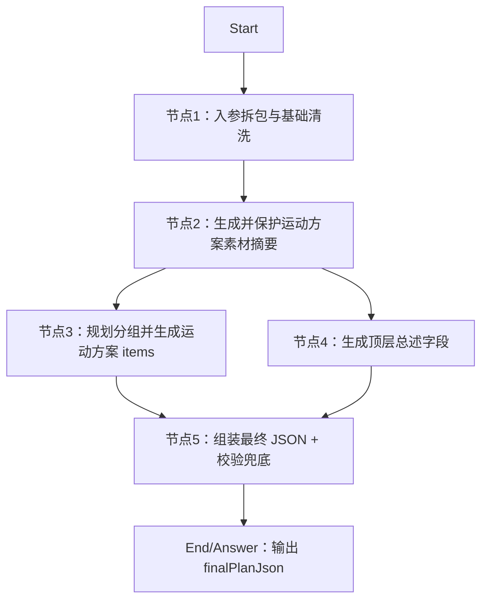

# DIFY工程-AI干预方案-运动方案-得到JSON

## 工程定位

本工程用于在 DIFY 中搭建“AI 干预方案-运动方案”工作流。工作流接收患者基础档案、专病档案、近 1 年随访/指标/饮食/运动/取药记录、当前控制目标和健管师本次方案要求，输出可供 H5 渲染、健管师审阅修改的标准化运动方案 JSON。

本工程对应总入参 `planType=sport`。

## 节点总览



## Start 入参建议

```json
{
  "planType": "sport",
  "planGoalAndRequirements": "",
  "extraSupplement": "",
  "basicProfile": {},
  "diseaseProfile": {},
  "followupRecordsLast1y": [],
  "metricRecordsLast1y": [],
  "dietRecordsLast1y": [],
  "exerciseRecordsLast1y": [],
  "medPickupRecords1y": [],
  "activeControlGoals": []
}
```

## 最终输出

节点5输出：

```json
{
  "finalPlanJson": {
    "planName": "运动健康处方",
    "planTitle": "个性化运动管理建议",
    "planSummary": "方案概述",
    "executionPoints": "执行要点",
    "groups": []
  },
  "finalPlanJsonText": "{}",
  "validationErrors": [],
  "validationErrorsCount": 0,
  "groupsCount": 0
}
```

建议 End 节点直接返回 `finalPlanJson`；如果下游接口只接收字符串，可返回 `finalPlanJsonText`。

## 编排要点

- 节点1会带出 `planType`，如果不是 `sport` 会在 `routeWarning` 中提示调用方检查路由。
- 节点2用 1 个 LLM 同时生成 `medicalGoalSummary`、`sportExecutionSummary`、`safetyBoundarySummary`，再用代码保护出参格式，输出稳定的 `materialSummaryBundle`。
- 节点2只做“证据摘要”，不直接生成患者最终建议正文。
- 节点3用 1 个 LLM 同时输出 `groupPlan` 和 `groups/items`，再用代码保护出参格式，减少“先规划、再生成 items”的串行等待。
- 节点3生成 `groups/items` 时要求 `importance` 只能取 `重点执行`、`常规建议`、`补充建议`，且 group/item 同层字段必须齐全。
- 节点4与节点3并行生成顶层文案字段，不依赖 `groups/items`，并用代码保护出参格式，减少串行等待。
- 节点5负责组装节点3和节点4的出参，并做排序、字段兜底和结构校验。

## 文件结构

```text
DIFY工程-AI干预方案-运动方案-得到JSON/
  README.md
  节点1-入参拆包与基础清洗/
  节点2-素材摘要/
  节点3-规划分组并生成运动方案items/
  节点4-生成顶层总述字段/
  节点5-组装最终JSON+校验兜底/
  测试数据/
```
