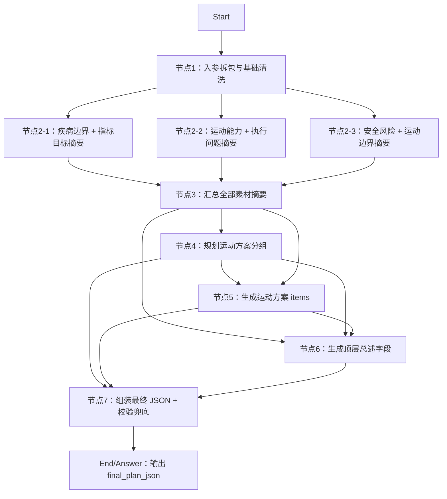

# DIFY工程-AI干预方案-运动方案

## 工程定位

本工程用于在 DIFY 中搭建“AI 干预方案-运动方案”工作流。工作流接收患者基础档案、专病档案、近 1 年随访/指标/饮食/运动/取药记录、当前控制目标和健管师本次方案要求，输出可供 H5 渲染、健管师审阅修改的标准化运动方案 JSON。

本工程对应总入参 `plan_type=sport`。

## 节点总览



## Start 入参建议

```json
{
  "plan_type": "sport",
  "plan_goal_and_requirements": "",
  "extra_supplement": "",
  "basic_profile": {},
  "disease_profile": {},
  "followup_records_last_1y": [],
  "metric_records_last_1y": [],
  "diet_records_last_1y": [],
  "exercise_records_last_1y": [],
  "medication_pickup_records_last_1y": [],
  "active_control_goals": []
}
```

## 最终输出

节点7输出：

```json
{
  "final_plan_json": {
    "plan_name": "运动健康处方",
    "plan_title": "个性化运动管理建议",
    "plan_summary": "方案概述",
    "execution_points": "执行要点",
    "groups": []
  },
  "final_plan_json_text": "{}",
  "validation_errors": []
}
```

建议 End 节点直接返回 `final_plan_json`；如果下游接口只接收字符串，可返回 `final_plan_json_text`。

## 编排要点

- 节点1会带出 `plan_type`，如果不是 `sport` 会在 `route_warning` 中提示调用方检查路由。
- 节点2的 3 个摘要 LLM 节点可以并行，减少耗时。
- 节点2只做“证据摘要”，不直接生成患者建议。
- 节点4只规划 `group_title` 和每组重点，不生成 `items`。
- 节点5生成 `groups/items`，要求 `importance` 只能取 `重点执行`、`常规建议`、`补充建议`。
- 节点6生成顶层文案字段，并且必须与节点5已生成内容一致。
- 节点7负责最终拼装、排序、字段兜底和结构校验，不把最终稳定性完全交给 LLM。

## 文件结构

```text
DIFY工程-AI干预方案-运动方案/
  README.md
  节点1-入参拆包与基础清洗/
  节点2-素材摘要/
    1疾病边界+指标目标摘要/
    2运动能力+执行问题摘要/
    3安全风险+运动边界摘要/
  节点3-汇总全部素材摘要/
  节点4-规划运动方案分组/
  节点5-生成运动方案items/
  节点6-生成顶层总述字段/
  节点7-组装最终JSON+校验兜底/
  测试数据/
```

