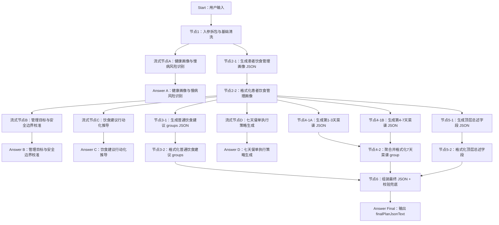

# DIFY工程-AI干预方案-饮食方案-Chatflow流式版

## 工程定位

本工程是在 `DIFY工程-AI干预方案-饮食方案-驼峰版` 基础上规划的 Chatflow 流式体验版。目标是在保留原有标准化饮食方案 JSON 产出的同时，让前端在等待生成期间持续展示阶段性分析内容，让用户感知到系统正在按严谨流程完成健康画像识别、目标与安全校准、饮食建议推导和 7 天餐单执行策略生成。

本版本不改变最终业务协议：最终仍输出 `finalPlanJsonText`，下游 H5 按 JSON 解析后渲染；新增的流式分析内容只用于过程展示，不参与最终 JSON 拼装。

## 设计原则

1. **结构化产出和用户可见分析分离**
   - 原有 LLM 节点继续负责产出 JSON、结构化字段或可被 Code 节点格式化的中间结果。
   - 新增流式分析节点只输出面向用户的自然语言，不承担 JSON 协议生成职责。

2. **Answer 节点负责触发流式展示**
   - Dify Chatflow 不会稳定透传每个中间 LLM 节点的 token。
   - 需要把用户可见分析节点接到 Answer 节点，由 Answer 引用该节点输出，前端才能在 `/chat-messages` 的 SSE 流里看到渐进内容。

3. **JSON 节点不直接暴露给前端**
   - 结构化输出、schema、格式化中间 JSON、代码节点日志都不放入用户可见 Answer。
   - 前端过程展示只呈现“我们正在分析什么、为什么这样生成、接下来会做什么”。

4. **最终 JSON 仍是唯一业务结果**
   - 前端可以展示过程分析，但保存、审阅、H5 渲染仍以 `finalPlanJsonText` 为准。
   - 过程分析不作为医疗建议的最终结构化来源。

## 节点总览



## Start 入参建议

沿用饮食方案 Workflow 版入参：

```json
{
  "planType": "diet",
  "planGoalAndRequirements": "",
  "extraSupplement": "",
  "basicProfile": {},
  "diseaseProfile": {},
  "followupRecordsLast1y": [],
  "metricRecordsLast1y": [],
  "dietRecordsLast1y": [],
  "exerciseRecordsLast1y": [],
  "medPickupRecords1y": [],
  "activeControlGoals": []
}
```

在 Dify Start 节点中，如果这些字段使用 `paragraph` 类型，接口调用时必须传字符串。对象和数组字段建议由调用方先 `JSON.stringify` 后放入 `inputs`，例如：

```json
{
  "inputs": {
    "planType": "diet",
    "basicProfile": "{\"demographics\":{\"gender\":\"男\",\"age\":62}}",
    "metricRecordsLast1y": "[{\"metricName\":\"体重\",\"value\":83.4,\"unit\":\"kg\"}]"
  },
  "query": "请生成饮食方案",
  "response_mode": "streaming",
  "user": "user-id"
}
```

## 流式输出设计

### 流式节点A：健康画像与慢病风险识别

**触发时机**：入参清洗完成后，与“生成患者饮食管理画像 JSON”并行执行。

**展示目标**：让用户知道系统正在分析患者基础信息、疾病指标、饮食行为、执行障碍和安全约束。

**建议输出风格**：

```text
我正在先梳理您的基础健康画像，会结合慢病情况、近期指标、饮食习惯和活动量，判断本次饮食方案的管理重点。若部分监测或控制目标暂时不完整，我会先按安全、稳妥的原则做初步判断，为后续建议留出复查和调整空间。
```

**表达要点**：

- 像 AI 健管师在做第一轮画像分析，重点呈现“正在看什么、正在判断什么”。
- 只围绕健康信息和服务动作表达，不进入工程实现细节。
- 信息不足时使用稳妥表达，让用户知道后续会结合记录继续调整。
- 控制在 80-140 字左右，用一个自然段完成，适合作为等待页短进度播报。

### 流式节点B：管理目标与安全边界校准

**触发时机**：患者饮食管理画像格式化后，先于“普通饮食建议”和“7 天餐单”两个体验分支展示。

**展示目标**：让用户知道系统会先校准本次饮食管理的优先级和安全边界，再进入具体建议生成。

**建议输出风格**：

```text
我会先校准这次饮食管理的优先级和安全边界。结合您的慢病背景，后续建议会优先围绕血糖平稳和血脂管理展开，同时关注主食份量、油脂来源、进餐节奏和低血糖风险。若近期资料不完整，方案会先稳妥起步，再随记录变化调整。
```

**表达要点**：

- 像健管师在做方案前的专业把关，先讲目标优先级，再讲安全边界。
- 重点体现控糖、控脂、减重等目标之间如何排序。
- 自然说明过敏、用药、低血糖、肾功能、近期指标等安全因素会影响后续安排。
- 信息不足时，表达为稳妥起步和后续调整。
- 控制在 80-140 字左右，用一个自然段完成，适合作为等待页短进度播报。

### 流式节点C：饮食建议行动化推导

**触发时机**：患者饮食管理画像格式化后，与“生成普通饮食建议 groups JSON”并行执行。

**展示目标**：说明系统如何把画像转化为普通饮食建议，让用户理解建议不是泛泛生成。

**建议输出风格**：

```text
接下来我会把前面的画像和目标校准，转成更容易执行的饮食动作。会优先判断哪些习惯可以保留，哪些环节先调整，再围绕主食份量、进餐顺序、优质蛋白、蔬菜摄入和控油控盐来组织建议，让方案更贴近日常场景。
```

**表达要点**：

- 像健管师在解释“如何把画像转成动作”，而不是宣布系统流程。
- 重点讲慢病目标、可保留习惯和接下来会展开的饮食行动方向。
- 可以提到主食、进餐顺序、蛋白质、蔬菜、控油控盐、外食等执行因素。
- 不提前给完整建议清单，避免和后续结构化建议重复。
- 控制在 80-140 字左右，用一个自然段完成，适合作为等待页短进度播报。

### 流式节点D：七天餐单执行策略生成

**触发时机**：患者饮食管理画像格式化后，与“生成第1-3天菜谱 JSON”和“生成第4-7天菜谱 JSON”并行执行。

**展示目标**：解释 7 天菜谱如何兼顾控糖、减重、控脂和实际执行场景。

**建议输出风格**：

```text
我正在把前面的管理目标转成 7 天饮食执行安排。接下来会平衡低升糖主食、足量蔬菜、优质蛋白和少油少盐，同时兼顾准备难度和长期坚持。若部分评估依据暂时不完整，份量和搭配会先稳妥安排，后续再根据监测结果细化。
```

**表达要点**：

- 让用户理解 7 天安排需要兼顾疾病目标、营养搭配、执行难度和安全边界。
- 重点呈现取舍逻辑，不提前展开每日菜品、克重和热量。
- 没有明确生活场景时，不主动假设夜班、食堂、外卖等具体条件。
- 信息不足时使用“初步、稳妥、后续调整”的专业表达。
- 控制在 80-140 字左右，用一个自然段完成，适合作为等待页短进度播报。

## 最终输出

最终业务输出仍由节点6生成：

```json
{
  "finalPlanJsonText": "{\"planName\":\"饮食健康处方\",\"planTitle\":\"个性化饮食管理建议\",\"planSummary\":\"方案概述\",\"executionPoints\":\"执行要点\",\"groups\":[]}",
  "validationErrors": "[]",
  "validationErrorsCount": 0,
  "groupsCount": 0
}
```

Chatflow 最终 Answer 节点建议只输出 `finalPlanJsonText`，或按前端约定包一层明确标识，例如：

```text
FINAL_PLAN_JSON:
{{#节点6.finalPlanJsonText#}}
```

前端应将 `FINAL_PLAN_JSON:` 之后的内容作为最终业务结果解析，不把前面的流式过程分析写入最终方案 JSON。

## 编排要点

- 原有结构化 LLM 节点继续开启结构化输出或保持严格 JSON prompt。
- 新增 4 个流式分析节点使用自然语言 prompt，不要求 JSON 格式。
- 新增流式分析节点的提示词要像给专业健管师交代工作方式，少写工程约束，多诱导模型自然呈现“正在阅读哪些信息、正在做哪些判断、接下来如何取舍”。每段过程播报控制在短句自然段，避免生成完整问诊报告。
- Answer 节点的文案顺序决定前端看到的流式顺序；每段过程分析都应由独立 Answer 输出。
- 面向用户的 Answer 标题建议稳定：
  - `健康画像与慢病风险识别`
  - `管理目标与安全边界校准`
  - `饮食建议行动化推导`
  - `七天餐单执行策略生成`
  - `最终饮食方案 JSON`
- Code 节点只处理格式化、兜底和校验，不输出用户可见过程文案。
- 如果某个流式分析节点失败，不应阻断最终 JSON 主链路；Dify 编排中可将它作为体验增强分支处理。

## 验证方式

使用现有 Chatflow demo 调用 `/chat-messages`：

```bash
cd "/Users/Tristan/TristansDevelop/TristanProject/AIHcare/【专项】干预方案/02-DIFY工程/DIFY工程-AI干预方案-饮食方案-驼峰版"
DIFY_API_KEY="app-***" node demo/dify-chatflow-streaming-demo.mjs
```

需要验证：

1. 响应头为 `text/event-stream`。
2. 终端或前端展示顺序符合：

```text
健康画像与慢病风险识别
管理目标与安全边界校准
饮食建议行动化推导
七天餐单执行策略生成
最终饮食方案 JSON
```

3. 用户可见过程内容不包含结构化 JSON、schema、代码节点日志。
4. 最终 `finalPlanJsonText` 可被 `JSON.parse` 解析，并包含 `planName`、`planTitle`、`groups`。
5. 正式前端可展示模型流式生成中的分析过程；如果出现工程实现、提示词复述或调试痕迹，前端可做兜底过滤。

## 后续拆分建议

README 确认后，再按以下目录补齐 Dify 工程材料：

```text
DIFY工程-AI干预方案-饮食方案-Chatflow流式版/
  README.md
  流式节点A-健康画像与慢病风险识别/
    【prompt】健康画像与慢病风险识别
  流式节点B-管理目标与安全边界校准/
    【prompt】管理目标与安全边界校准
  流式节点C-饮食建议行动化推导/
    【prompt】饮食建议行动化推导
  流式节点D-七天餐单执行策略生成/
    【prompt】七天餐单执行策略生成
  测试数据/
    【入参】Chatflow流式版测试入参.json
    【出参示例】Chatflow流式事件摘录.md
```
