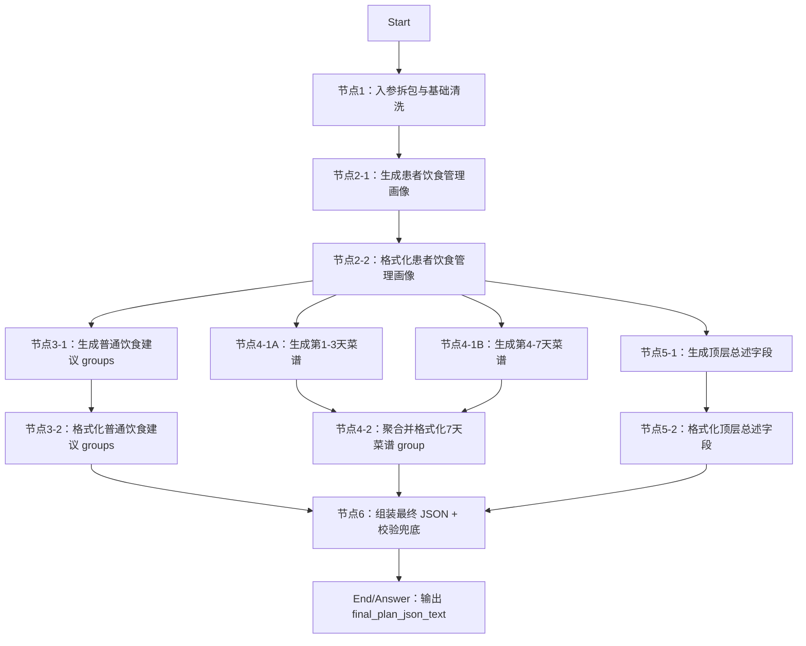

# DIFY工程-AI干预方案-饮食方案

## 工程定位

本工程用于在 DIFY 中搭建“AI 干预方案-饮食方案”工作流。工作流接收患者基础档案、专病档案、近 1 年随访/指标/饮食/运动/取药记录、当前控制目标和健管师本次方案要求，输出可供 H5 渲染、健管师审阅修改的标准化饮食方案 JSON。

本工程对应总入参 `plan_type=diet`。

工程组织方式参考 `AIRS/智能审核流程ai_recognize_workflow/DIFY工程-智能审核流程`：按节点拆目录，LLM 节点放 prompt，Code 节点同时放代码和出入参说明，测试数据单独放置。

## 节点总览



## Start 入参建议

```json
{
  "plan_type": "diet",
  "plan_goal_and_requirements": "",
  "extra_supplement": "",
  "basic_profile": {},
  "disease_profile": {},
  "followup_records_last_1y": [],
  "metric_records_last_1y": [],
  "diet_records_last_1y": [],
  "exercise_records_last_1y": [],
  "med_pickup_records_1y": [],
  "active_control_goals": []
}
```

## 最终输出

节点6输出：

```json
{
  "final_plan_json_text": "{\"plan_name\":\"饮食健康处方\",\"plan_title\":\"个性化饮食管理建议\",\"plan_summary\":\"方案概述\",\"execution_points\":\"执行要点\",\"groups\":[]}",
  "validation_errors": "[]",
  "validation_errors_count": 0,
  "groups_count": 0
}
```

建议 End 节点直接返回 `final_plan_json_text`。该字段是 JSON 字符串，下游 H5 或接口需按 JSON 解析后渲染。

## 编排要点

- 节点1做输入清洗、字段兜底、记录截断和 `plan_type` 路由提示，不做业务判断。
- 节点2-1生成“患者饮食管理画像”，同时完成饮食目的识别、证据摘要和个性化生成提示；DIFY 中应开启结构化输出。
- 节点2-2格式化画像出参，兼容结构化输出字段和 `text` JSON，输出同名稳定字段供节点3/4/5引用。
- 节点2不直接生成患者建议正文，但必须保留疾病指标、饮食行为、执行障碍、安全约束、能量平衡、用药提醒、可保留习惯、优先管理重点和缺失信息。
- 节点3-1生成普通饮食建议 `groups/items`，普通建议 group 使用 `group_type=advice_list`。
- 节点3-2格式化普通建议出参，固定 `group_type/item_type`，输出可供节点6引用的 `groups` 字符串。
- 节点4-1A生成第1-3天菜谱，节点4-1B生成第4-7天菜谱；两个节点并行执行，降低单个 LLM 节点输出耗时。
- 节点4-2聚合并格式化两段菜谱出参，固定 `group_type/display_style`，输出可供节点6引用的 `meal_plan_group` 字符串。
- 节点5-1基于节点2画像生成顶层文案字段，和节点3、节点4并行执行；文案使用保守总述，不依赖普通建议和菜谱的实际输出。
- 节点5-2格式化顶层文案出参，输出节点6建议引用的 `plan_header` 字符串。
- 节点6负责最终拼装、字段兜底和结构校验，不生成业务内容。

## 文件结构

```text
DIFY工程-AI干预方案-饮食方案/
  README.md
  节点1-入参拆包与基础清洗/
    代码-入参拆包与基础清洗.py
    【代码出入参说明】代码-入参拆包与基础清洗.md
  节点2-患者饮食管理画像/
    【prompt】生成患者饮食管理画像
    【结构化输出】患者饮食管理画像.schema.json
    代码-格式化患者饮食管理画像.py
    【代码出入参说明】代码-格式化患者饮食管理画像.md
  节点3-生成普通饮食建议groups/
    【prompt】生成普通饮食建议groups
    代码-格式化普通饮食建议groups.py
    【代码出入参说明】代码-格式化普通饮食建议groups.md
  节点4-生成7天菜谱group/
    【prompt】生成第1-3天菜谱group
    【prompt】生成第4-7天菜谱group
    代码-格式化7天菜谱group.py
    【代码出入参说明】代码-格式化7天菜谱group.md
  节点5-生成顶层总述字段/
    【prompt】生成顶层总述字段
    代码-格式化顶层总述字段.py
    【代码出入参说明】代码-格式化顶层总述字段.md
  节点6-组装最终JSON+校验兜底/
    代码-组装最终JSON+校验兜底.py
    【代码出入参说明】代码-组装最终JSON+校验兜底.md
  测试数据/
    【入参】饮食方案工作流测试入参.json
    【出参示例】饮食方案最终JSON.json
```
