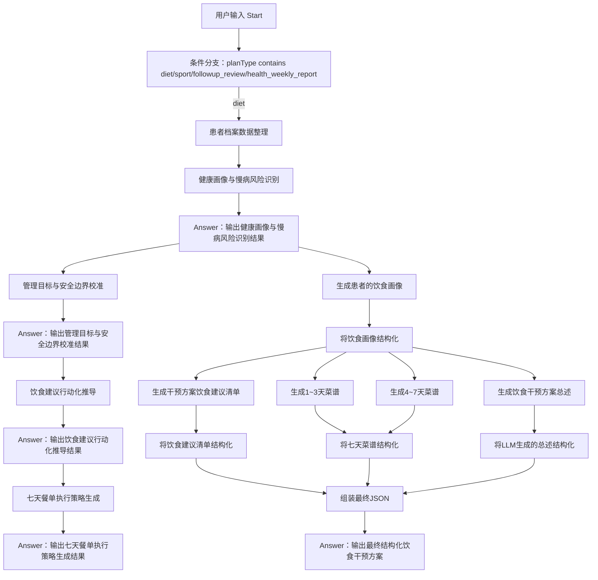
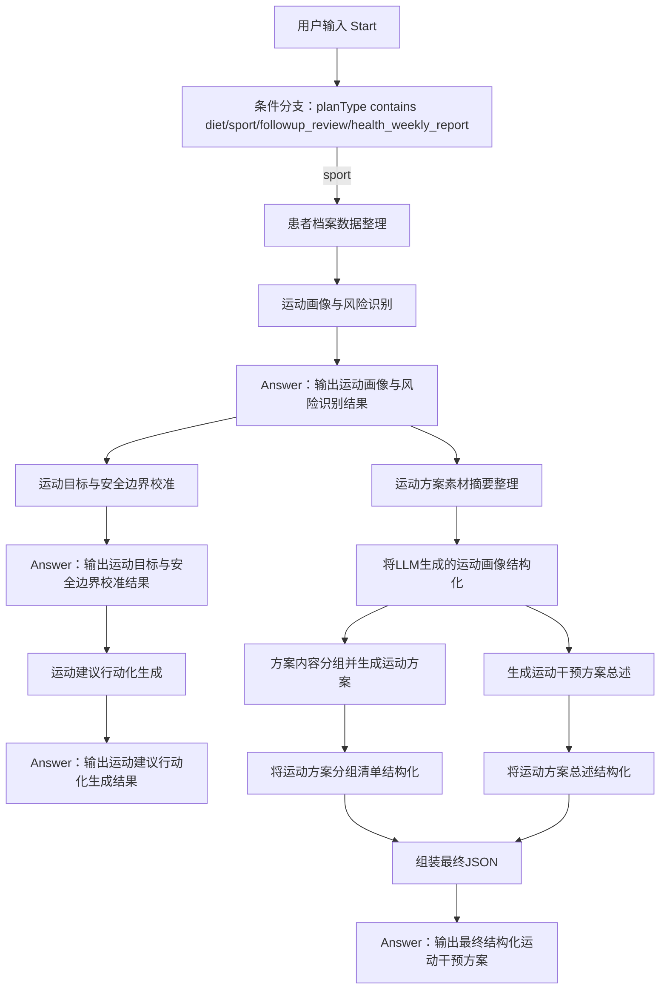

# 02-DIFY工程

这个目录记录 AIHcare 干预方案相关的 Dify 工程资料、节点说明、测试数据和历史调试记录。

当前主线是统一版 Chatflow：Dify 应用名为 `干预方案-V4-chatflow`，应用模式为 `advanced-chat`。这份 Chatflow 同时承载饮食方案、运动方案、复诊复查指导和健康周报，运行时通过入参 `planType` 分流：

- `planType=diet`：进入饮食干预方案分支。
- `planType=sport`：进入运动干预方案分支。
- `planType=followup_review`：进入复诊复查指导分支。
- `planType=health_weekly_report`：进入健康周报分支。

目录中的“饮食方案 / 运动方案 / 复诊复查指导 / 健康周报”不是独立 Dify 应用，而是同一个 V4 Chatflow 的四个业务分支。每个方案目录内同时保留结构化 JSON 生成节点和用户可见的流式展示节点。

当前已验证导入并发布通过的 Dify 导出文件保留在 `DIFY原工程/` 目录。本 README 记录该 V4 工程的节点线路、输入输出约定和本地资料目录之间的对应关系。

## 目录结构

```text
02-DIFY工程/
  README.md
  DIFY原工程/
    README.md
    版本更新记录.md
    干预方案-V4-chatflow-含健康周报.yml
  demo/
    README.md
    dify_aihcare_diet_runner.py
    dify_aihcare_sport_runner.py
    dify_aihcare_followup_review_runner.py
    dify_aihcare_health_weekly_report_runner.py
    tests/
    userinput/
  饮食方案/
    DIFY工程-AI干预方案-饮食方案/
      README.md
      测试数据/
      节点1-入参拆包与基础清洗/
      节点2-患者饮食管理画像/
      节点3-生成普通饮食建议groups/
      节点4-生成7天菜谱group/
      节点5-生成顶层总述字段/
      节点6-组装最终JSON+校验兜底/
      流式节点A-健康画像与慢病风险识别/
      流式节点B-管理目标与安全边界校准/
      流式节点C-饮食建议行动化推导/
      流式节点D-七天餐单执行策略生成/
  运动方案/
    DIFY工程-AI干预方案-运动方案/
      README.md
      测试数据/
      真实dify调试记录/
      节点1-入参拆包与基础清洗/
      节点2-素材摘要/
      节点3-规划分组并生成运动方案items/
      节点4-生成顶层总述字段/
      节点5-组装最终JSON+校验兜底/
      流式节点A-运动画像与风险识别/
      流式节点B-运动目标与安全边界校准/
      流式节点C-运动建议行动化生成/
  复诊复查指导/
    DIFY工程-AI干预方案-复诊复查指导/
  健康周报/
    DIFY工程-AI干预方案-健康周报/
```

## 资料目录和 V4 Chatflow 的关系

| 目录 | 对应分支 | 资料用途 |
| --- | --- | --- |
| `DIFY原工程/` | V4 统一 Chatflow | 已验证 Dify yml、原文件地址和版本更新记录 |
| `demo/` | `planType=diet` / `planType=sport` / `planType=followup_review` / `planType=health_weekly_report` | 整个干预方案 Chatflow 的本地联调 runner、归档结果和本地单测 |
| `饮食方案/DIFY工程-AI干预方案-饮食方案/` | `planType=diet` | 饮食分支结构化 JSON 生成、流式过程展示、测试数据和节点说明 |
| `运动方案/DIFY工程-AI干预方案-运动方案/` | `planType=sport` | 运动分支结构化 JSON 生成、流式过程展示、测试数据、调试记录和节点说明 |
| `复诊复查指导/DIFY工程-AI干预方案-复诊复查指导/` | `planType=followup_review` | 复诊复查指导分支结构化 JSON 生成、流式过程展示、测试数据和节点说明 |
| `健康周报/DIFY工程-AI干预方案-健康周报/` | `planType=health_weekly_report` | 健康周报分支结构化 JSON 生成、流式过程展示、测试数据和节点说明 |

本地 demo runner 是同一个 V4 Chatflow 的四个测试入口：

| runner | 含义 | 分支 | 测试重点 |
| --- | --- | --- | --- |
| `dify_aihcare_diet_runner.py` | 饮食方案联调 | `planType=diet` | 流式阶段输出和最终 `finalPlanJsonText` |
| `dify_aihcare_sport_runner.py` | 运动方案联调 | `planType=sport` | 流式阶段输出和最终 `finalPlanJsonText` |
| `dify_aihcare_followup_review_runner.py` | 复诊复查指导联调 | `planType=followup_review` | 流式阶段输出和最终 `finalPlanJsonText` |
| `dify_aihcare_health_weekly_report_runner.py` | 健康周报联调 | `planType=health_weekly_report` | 流式阶段输出和最终 `finalPlanJsonText` |

## 统一入参

Chatflow Start 节点建议接收以下入参：

```json
{
  "planType": "diet",
  "planGoalAndRequirements": "",
  "extraSupplement": "",
  "basicProfile": {},
  "diseaseProfile": {},
  "followupRecordsLast1y": [],
  "metricRecordsLast1y": [],
  "dietRecordsLast1y": [],
  "exerciseRecordsLast1y": [],
  "medPickupRecords1y": [],
  "activeControlGoals": []
}
```

字段说明：

- `planType` 是总入口路由字段，当前用于区分 `diet` / `sport` / `followup_review` / `health_weekly_report`。
- `planGoalAndRequirements` 是本次方案目标与要求。
- `extraSupplement` 是额外补充信息。
- `basicProfile`、`diseaseProfile` 是基础档案和疾病档案。
- `followupRecordsLast1y`、`metricRecordsLast1y`、`dietRecordsLast1y`、`exerciseRecordsLast1y`、`medPickupRecords1y` 是近一年管理素材。
- `activeControlGoals` 是当前主动控制目标。
- 饮食分支也保留 `exerciseRecordsLast1y`，用于辅助判断体重管理、能量消耗和生活方式执行能力。
- 饮食分支也保留 `medPickupRecords1y`，用于辅助判断依从性、低血糖风险和饮食建议边界。
- 在 Dify Start 节点中，`planType` 是 select，其余档案和记录字段使用 paragraph。接口调用时，对象和数组字段需要先由调用方 `JSON.stringify` 成字符串后传入。

## 统一出参

最终业务内容统一以 `finalPlanJsonText` 输出。该字段是 JSON 字符串，下游 H5 或接口需要先 `JSON.parse`，再按协议渲染。

```json
{
  "finalPlanJsonText": "{\"planName\":\"饮食健康处方\",\"planTitle\":\"个性化饮食管理建议\",\"planSummary\":\"方案概述\",\"executionPoints\":\"执行要点\",\"groups\":[]}",
  "validationErrors": "[]",
  "validationErrorsCount": 0,
  "groupsCount": 0
}
```

Dify Code 节点对返回 Object 的层级有限制，最终方案可能包含 `groups.items.meals.foods` 等深层结构，因此下游统一以 `finalPlanJsonText` 为准。部分分支的组装节点会同时保留 `finalPlanJson` Object 供 Dify 内部调试，但 H5 和接口消费时仍优先解析 `finalPlanJsonText`。

最终 Answer 节点会用 `<FINAL_PLAN_JSON>` 包裹最终业务 JSON 字符串，方便前端从流式过程文本中定位最终结果：

```text
<FINAL_PLAN_JSON>
{{#组装最终JSON.finalPlanJsonText#}}</FINAL_PLAN_JSON>
```

H5 展示约定：

- 饮食、运动、复诊复查指导和健康周报的业务展示内容都来自 `finalPlanJsonText`。
- 患者姓名等外部展示信息不写入 Dify 业务 JSON，可由 H5 外部参数单独传入。
- `finalPlanJsonText` 解析后的对象至少包含 `planName`、`planTitle`、`planSummary`、`executionPoints`、`groups`。

## 饮食分支设计

饮食分支面向健管师使用，不直接和患者多轮聊天采集档案。它根据患者档案、近一年管理记录、当前控制目标和本次方案要求，生成一份以饮食干预为核心的结构化方案 JSON，供健管师审阅修改后交给 H5 页面渲染。

设计原则：

- 节点数量控制在可维护范围内，避免为了工程化拆出过多中间节点。
- 患者画像节点不做简单摘要，而是生成“患者饮食管理画像”，保留个性化管理细节。
- 菜谱单独由 LLM 节点生成，避免 7 天三餐结构和普通建议互相干扰。
- 最终方案文案生成和 JSON 组装校验分离，LLM 负责内容，Code 节点负责拼装、补默认值和结构校验。
- 最终出参保持标准化顶层结构，不为饮食方案新增顶层字段；个性化展示通过 `groups[].groupType` 和 group/item 扩展字段表达。
- 最终 JSON 同一层级字段集合保持一致：不同 `groupType` 的 group、不同 `itemType` 的 item 都补齐同名字段，没有值时输出空字符串、空数组或空对象。

### 饮食节点拓扑



说明：饮食分支里的流式节点不是完全独立的旁路增强分支。原工程中，`健康画像与慢病风险识别` 的 Answer 输出之后，才继续进入 `生成患者的饮食画像`；同时该 Answer 也串起后续的流式展示链路。

### 节点1：入参拆包与基础清洗

职责：

- 对 Start 入参做空值兜底、字段重命名、过长数组截断和明显脏数据剔除。
- 解析对象/数组 JSON 字符串后，递归把内部下划线字段归一为驼峰字段，兼容上游暂未完全改造的传参。
- 构造 `medicalGoalContext`、`dietExecutionContext`、`safetyEnergyContext`。
- 带出 `planType` 和 `routeWarning`，提醒调用方检查路由。
- 不做业务判断，不直接生成建议。

建议输出：

```json
{
  "medicalGoalContext": {},
  "dietExecutionContext": {},
  "safetyEnergyContext": {},
  "planGoalAndRequirements": "",
  "extraSupplement": "",
  "planType": "diet",
  "routeWarning": "",
  "inputStats": {}
}
```

### 节点2：患者饮食管理画像

节点2由两个子节点组成：

- `节点2-1 LLM：患者饮食管理画像`
- `节点2-2 Code：格式化患者饮食管理画像`

LLM 节点职责：

- 一次性读取节点1整理后的三类上下文。
- 识别本次饮食方案目的，例如减重、控糖、优化代谢、术后康复等。
- 通过 Prompt 要求输出合法 JSON，输出可被后续 Code 节点解析和格式化的个性化管理画像。
- 不直接生成患者建议正文。

Code 节点职责：

- 解析 LLM 节点的 `text` JSON。当前 Dify 使用的模型不支持结构化输出，因此不依赖 Dify 结构化输出能力。
- 合法化 `dietPlanGoal`，补齐 `dietPlanGoalLabel`、`goalBasis`。
- 补齐 `patientContextPack` 的固定维度，保证每条 item 至少包含 `evidence`、`impact`、`generationHint`。
- 将 `patientContextPack`、`materialSummaryBundle`、`formattedProfileJson` 输出为 JSON 字符串，方便后续 LLM 节点引用。

建议后续节点引用：

```text
{{#节点2-2.dietPlanGoal#}}
{{#节点2-2.dietPlanGoalLabel#}}
{{#节点2-2.goalBasis#}}
{{#节点2-2.patientContextPack#}}
{{#节点2-2.materialSummaryBundle#}}
```

画像要求：

- 每个数组建议 1-5 条。
- 每条尽量包含 `evidence`、`impact`、`generationHint`。
- `priorityManagementFocus` 必须输出 3-5 条，作为后续普通建议和菜谱生成的核心依据。
- 对信息缺失要明确写入 `missingInformation`，不要通过编造补齐。
- `dietPlanGoal` 是流程内部判断字段，不进入最终标准 JSON；最终菜谱 group 只保留 `dietPlanGoalLabel` 和 `goalBasis`。

### 节点3：生成普通饮食建议 groups

节点3由两个子节点组成：

- `节点3-1 LLM：生成普通饮食建议 groups`
- `节点3-2 Code：格式化普通饮食建议 groups`

LLM 节点职责：

- 根据节点2-2的 `patientContextPack` 生成普通饮食建议。
- 优先使用 `priorityManagementFocus`，选择 2-4 个最重要的普通建议 group。
- 不生成 7 天菜谱。

Code 节点职责：

- 固定普通建议 group 的 `groupType=adviceList`。
- 固定普通建议 item 的 `itemType=advice`。
- 跳过误输出的 `weeklyMealPlan`，避免普通建议节点侵入节点4职责。
- 将格式化后的 `groups` 输出为 JSON 字符串。
- 将缺少 group 标题、item 内容、非法 importance 等问题写入 `formatWarnings`。

生成要求：

- `content` 必须具体、短句、可执行。
- `focusPoint` 说明依据、注意事项、适用边界和风险提醒。
- 必须吸收执行障碍、安全约束、可保留习惯和缺失信息，避免泛泛而谈。
- `importance` 只能取 `重点执行` / `常规建议` / `补充建议`。

建议后续节点引用：

```text
{{#节点3-2.groups#}}
```

### 节点4：生成最近 7 天菜谱 group

节点4由三个子节点组成：

- `节点4-1A LLM：生成第1-3天菜谱 group`
- `节点4-1B LLM：生成第4-7天菜谱 group`
- `节点4-2 Code：聚合并格式化7天菜谱 group`

LLM 节点职责：

- 根据节点2识别出的饮食目的和患者画像，分段生成 `groupType=weeklyMealPlan` 的菜谱分组。
- 节点4-1A只输出 day=1-3，节点4-1B只输出 day=4-7。
- 两个 LLM 节点并行执行，降低单个节点输出耗时。
- 与节点3普通建议并行生成，职责只聚焦菜谱；最终一致性由节点5总述和节点6组装校验兜底。

Code 节点职责：

- 合并第1-3天和第4-7天菜谱，按 `day` 升序排序，重复天数保留首次出现。
- 固定 `groupType=weeklyMealPlan` 和 `displayStyle=weeklyMealPlan`。
- 归一每天、每餐和每个食物的核心字段，输出节点5和节点6可直接引用的 `mealPlanGroup` 字符串。
- 将非 7 天、缺少三餐、缺少有效食物等问题写入 `formatWarnings`。

菜谱要求：

- 合并后必须覆盖 day=1-7。
- 每天必须包含早餐、午餐、晚餐。
- `mealName` 只能使用 `早餐`、`午餐`、`晚餐`、`加餐`、`夜班加餐`；食堂、外卖、夜班等场景放在 `mealScene`。
- 每餐必须包含食物名称、克重、热量、蛋白质、脂肪。
- 每天必须有 `dailyTotalKcal`、`dailyTotalProteinG`、`dailyTotalFatG`。
- 如果目标包含减重，每天输出 `estimatedEnergyDeficitKcal`。
- 必须结合患者执行障碍，例如夜班、外卖、不会做饭、工作餐等场景。

建议后续节点引用：

```text
{{#节点4-2.mealPlanGroup#}}
```

### 节点5：生成顶层总述字段

节点5由两个子节点组成：

- `节点5-1 LLM：生成顶层总述字段`
- `节点5-2 Code：格式化顶层总述字段`

LLM 节点职责：

- 根据节点2画像生成最终 JSON 顶层文案字段。
- 与节点3普通建议和节点4菜谱并行执行，因此文案使用保守总述，不依赖后两者的实际输出。
- 不负责生成 group 或 item。

Code 节点职责：

- 兜底 `planName`、`planTitle`、`planSummary`、`executionPoints`。
- 输出节点6建议引用的 `planHeader` 字符串。
- 对“患者”“该患者”“结合患者情况”等偏病历或内部表达写入 `formatWarnings`，便于调试时发现患者端口吻问题。

生成要求：

- `planSummary` 要概括为什么这样安排、主要围绕哪些饮食方向、预期帮助什么问题。
- 如果存在 7 天菜谱，要明确提到“最近7天执行菜谱”。
- `executionPoints` 要强调优先级、记录/反馈要求、安全边界和何时联系医生或健管师。
- 顶层文案必须和节点2画像保持一致，不编造节点2没有依据的模块、目标或事实。

建议节点6引用：

```text
{{#节点5-2.planHeader#}}
```

### 节点6：组装最终 JSON + 校验兜底

职责：

- 将节点5-2顶层总述字段、节点3-2普通建议和节点4-2菜谱组装为最终标准 JSON。
- 将 `mealPlanGroup` 追加到最终 `groups`。
- 补齐缺失顶层字段和数组字段。
- 按层级补齐字段集合，保证所有 group 字段数量一致、所有 item 字段数量一致；meal 和 food 层也按同层级字段补齐。
- 将非法或缺失的 `importance` 统一归一到 `常规建议`。
- 对空文本字段做兜底，避免 H5 模板渲染异常。
- 对 `groupType=weeklyMealPlan` 做 7 天、三餐和营养字段校验。
- 返回可定位的 `validationErrors`，或降级输出最小可渲染 JSON。

## 饮食分支串并行关系

- `用户输入` 先进入条件分支，`planType` 包含 `diet` 时进入饮食患者档案数据整理。
- 饮食患者档案数据整理后，先进入 `健康画像与慢病风险识别`，再由 Answer 输出该阶段流式结果。
- `输出健康画像与慢病风险识别结果` 同时连接到 `管理目标与安全边界校准` 和 `生成患者的饮食画像`。
- `管理目标与安全边界校准`、`饮食建议行动化推导`、`七天餐单执行策略生成` 通过各自 Answer 串联，形成用户可见的流式展示链路。
- `生成患者的饮食画像` 进入 `将饮食画像结构化` 后，分出普通饮食建议、1-3 天菜谱、4-7 天菜谱和饮食总述四条结构化生成链路。
- `将饮食建议清单结构化`、`将七天菜谱结构化`、`将LLM生成的总述结构化` 汇入 `组装最终JSON`。
- 最终 Answer 输出 `<FINAL_PLAN_JSON>` 包裹的 `finalPlanJsonText`。

## 饮食分支风险与注意事项

- 如果节点2过度总结，后续会丢失关键个性化依据；因此节点2必须输出 `evidence`、`impact`、`generationHint` 三段式画像。
- 如果节点3普通建议过多，H5 页面会显得啰嗦；建议控制在 2-4 个普通建议 group。
- 如果节点4菜谱没有结合执行障碍，方案会变成“看起来正确但做不到”；菜谱 prompt 必须要求外食、夜班、工作餐等场景适配。
- 如果各 LLM 节点输出格式不稳定，优先在 Code 节点做 JSON 解析和字段兜底，同时在 Prompt 中明确“只输出 JSON”。
- 饮食处方内容属于健康管理建议，不替代医生诊断、处方药调整和急症处理决策；涉及明显异常指标、疑似禁忌或高风险情况时，应在 `focusPoint` 和 `executionPoints` 中提示及时联系医生或健管师。

## 运动分支设计

运动分支和饮食分支共享统一入参、统一出参和 `finalPlanJsonText` 约定。当前资料目录中运动分支集中在 `运动方案/DIFY工程-AI干预方案-运动方案/`，同时包含结构化运动方案生成节点和用户可见的流式过程展示节点。

### 运动节点拓扑



说明：运动分支也不是完全并行的流式旁路。原工程中，`运动画像与风险识别` 的 Answer 输出之后，才继续进入 `运动方案素材摘要整理`；同时该 Answer 也串起后续的运动流式展示链路。

运动分支最终 Answer 节点输出结构化运动干预方案，业务内容仍以 `finalPlanJsonText` 为准。和饮食分支不同，运动分支当前的 `组装最终JSON` 同时输出 `finalPlanJson` Object 和 `finalPlanJsonText` 字符串；调用方和 H5 展示仍优先使用 `finalPlanJsonText`。

## 复诊复查指导分支设计

复诊复查指导分支用于根据患者基础档案、专病档案、近一年随访/指标/饮食/运动/取药记录和当前控制目标，生成复诊安排、复查项目、异常提前就医触发、资料准备和结果回传等通用清单。

该分支对应 `planType=followup_review`，资料目录为 `复诊复查指导/DIFY工程-AI干预方案-复诊复查指导/`。最终输出复用通用 `groups/items` 协议，不新增 H5 专用字段。

结构化链路：

- 节点1清洗入参并输出疾病状态、复诊需求和安全触发上下文。
- 节点2生成 `medicalStatusSummary`、`reviewNeedSummary`、`safetyTriggerSummary`。
- 节点3生成复诊复查指导分组和建议条目。
- 节点4生成顶层总述字段。
- 节点5组装最终 JSON，兜底为“复诊复查总原则”。

## 健康周报分支设计

健康周报分支用于汇总患者最近 7 天健康情况，包括指标变化、饮食执行、运动执行、随访/用药相关信息，并给出总结性报告。

该分支对应 `planType=health_weekly_report`，资料目录为 `健康周报/DIFY工程-AI干预方案-健康周报/`。健康周报是总结性报告，不生成饮食处方、运动处方、7 天菜谱、训练计划或复诊复查安排。

结构化链路：

- 节点1按输入记录中最新可识别日期向前推 7 天，输出指标变化、饮食运动和风险随访上下文。
- 节点2生成 `metricTrendSummary`、`dietExerciseSummary`、`riskAndFollowupSummary`。
- 节点3生成本周健康概览、指标变化总结、饮食执行总结、运动执行总结、风险提醒与下周关注等分组。
- 节点4生成顶层总述字段。
- 节点5组装最终 JSON，兜底为“健康周报总原则”。

已用 `dify_aihcare_health_weekly_report_runner.py` 真实调用发布后的 Dify 应用验证通过：最终 JSON 解析成功，节点无 exception，结构校验错误为 0。

## 后续维护规则

- 当前主线说明只维护在本 `README.md` 中，避免同级目录继续出现多个总览文档。
- 分支目录内的 README 只写该分支自己的节点、测试和调试细节。
- 最新可导入 Dify yml 放在 `DIFY原工程/`；旧版或中间导出不要放到工程根目录，也不要覆盖已验证文件。
- 调整最终 JSON 协议时，需要同步检查饮食、运动、复诊复查指导、健康周报四个分支的节点说明、测试数据、demo runner 和 H5 渲染。
