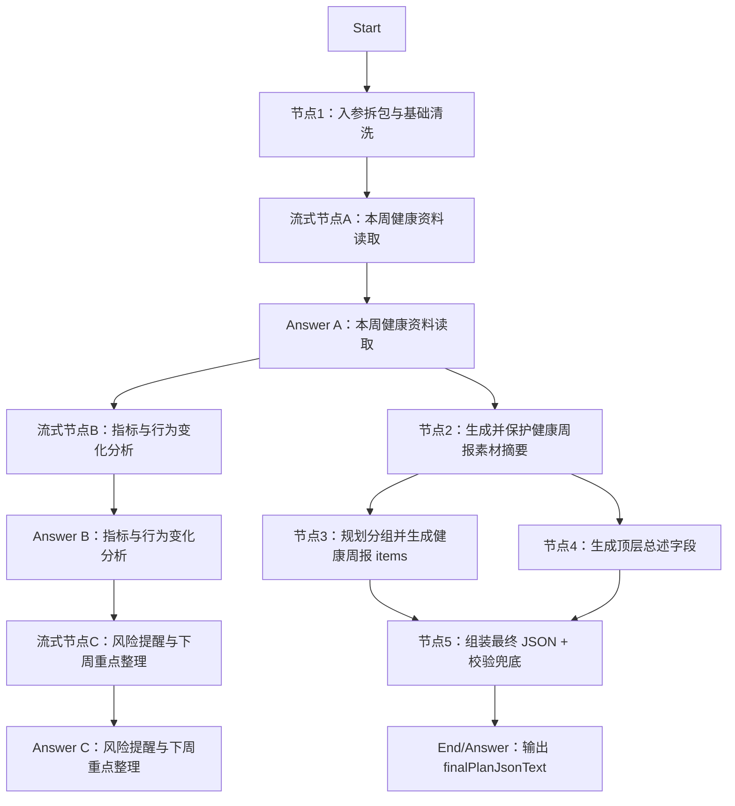

# DIFY工程-AI干预方案-健康周报

## 工程定位

本工程用于在 DIFY 中搭建“AI 干预方案-健康周报”分支。工作流接收患者基础档案、专病档案、近 1 年随访/指标/饮食/运动/取药记录、当前控制目标和健管师本次要求，优先抽取最近 7 天健康资料，输出可供 H5 渲染、健管师审阅修改的标准化健康周报 JSON，并在等待期间输出用户可见的流式阶段分析。

本工程对应总入参 `planType=health_weekly_report`。

健康周报是总结性报告，不生成饮食处方、运动处方、7 天菜谱、训练计划或复诊复查安排。

## 节点总览



说明：流式节点只输出自然语言过程展示，不参与最终 JSON 拼装；结构化节点负责生成、格式化和组装最终 `finalPlanJsonText`。

## Start 入参建议

```json
{
  "planType": "health_weekly_report",
  "planGoalAndRequirements": "",
  "extraSupplement": "",
  "basicProfile": {},
  "diseaseProfile": {},
  "followupRecordsLast1y": [],
  "metricRecordsLast1y": [],
  "dietRecordsLast1y": [],
  "exerciseRecordsLast1y": [],
  "medPickupRecords1y": [],
  "activeControlGoals": []
}
```

## 最终输出

节点5输出：

```json
{
  "finalPlanJson": {
    "planName": "健康周报",
    "planTitle": "最近7天健康情况总结",
    "planSummary": "周报概述",
    "executionPoints": "执行要点",
    "groups": []
  },
  "finalPlanJsonText": "{}",
  "validationErrors": [],
  "validationErrorsCount": 0,
  "groupsCount": 0
}
```

建议最终 Answer 节点统一返回 `finalPlanJsonText`。如果 Dify 内部节点同时保留 `finalPlanJson` Object，下游 H5 仍以 `finalPlanJsonText` 为准。

## 编排要点

- 节点1会带出 `planType`，如果不是 `health_weekly_report` 会在 `routeWarning` 中提示调用方检查路由。
- 节点1按输入记录中最新可识别日期向前推 7 天，输出 `metricTrendContext`、`dietExerciseContext`、`riskAndFollowupContext`。
- 节点2用 1 个 LLM 同时生成 `metricTrendSummary`、`dietExerciseSummary`、`riskAndFollowupSummary`，再用代码保护出参格式，输出稳定的 `materialSummaryBundle`。
- 节点3用 1 个 LLM 同时输出 `groupPlan` 和 `groups/items`，建议分组为本周健康概览、指标变化总结、饮食执行总结、运动执行总结、风险提醒与下周关注。
- 节点4与节点3并行生成顶层文案字段，不依赖 `groups/items`。
- 节点5负责组装节点3和节点4的出参，并做排序、字段兜底和结构校验。
- 面向用户的流式输出不暴露结构化 JSON、schema、代码节点日志和提示词工程细节。

## 文件结构

联调 demo 位于 `../../demo/`，用于统一测试整个干预方案 Chatflow。

```text
DIFY工程-AI干预方案-健康周报/
  README.md
  节点1-入参拆包与基础清洗/
  节点2-素材摘要/
  节点3-规划分组并生成健康周报items/
  节点4-生成顶层总述字段/
  节点5-组装最终JSON+校验兜底/
  流式节点A-本周健康资料读取/
  流式节点B-指标与行为变化分析/
  流式节点C-风险提醒与下周重点整理/
  测试数据/
```
