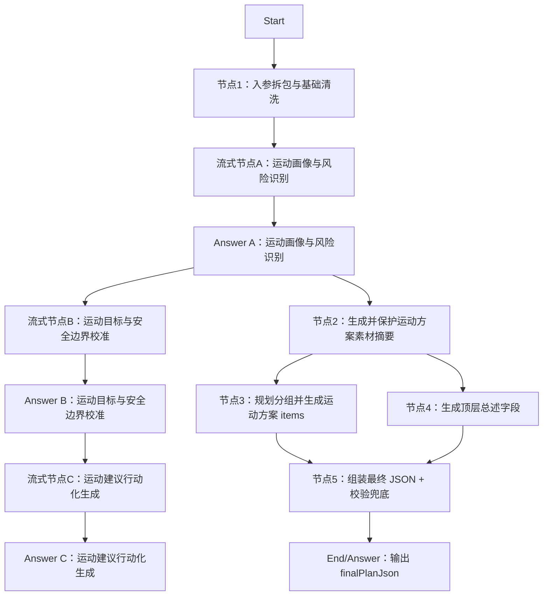

# DIFY工程-AI干预方案-运动方案

## 工程定位

本工程用于在 DIFY 中搭建“AI 干预方案-运动方案”分支。工作流接收患者基础档案、专病档案、近 1 年随访/指标/饮食/运动/取药记录、当前控制目标和健管师本次方案要求，输出可供 H5 渲染、健管师审阅修改的标准化运动方案 JSON，并在等待期间输出用户可见的流式阶段分析。

本工程对应总入参 `planType=sport`。

本目录同时包含结构化 JSON 生成节点和 Chatflow 流式展示节点。测试数据只保留一套，统一放在 `测试数据/`。

## 节点总览



说明：流式节点只输出自然语言过程展示，不参与最终 JSON 拼装；结构化节点仍负责生成、格式化和组装最终 `finalPlanJsonText`。

## Start 入参建议

```json
{
  "planType": "sport",
  "planGoalAndRequirements": "",
  "extraSupplement": "",
  "basicProfile": {},
  "diseaseProfile": {},
  "followupRecordsLast1y": [],
  "metricRecordsLast1y": [],
  "dietRecordsLast1y": [],
  "exerciseRecordsLast1y": [],
  "medPickupRecords1y": [],
  "activeControlGoals": []
}
```

## 最终输出

节点5输出：

```json
{
  "finalPlanJson": {
    "planName": "运动健康处方",
    "planTitle": "个性化运动管理建议",
    "planSummary": "方案概述",
    "executionPoints": "执行要点",
    "groups": []
  },
  "finalPlanJsonText": "{}",
  "validationErrors": [],
  "validationErrorsCount": 0,
  "groupsCount": 0
}
```

建议最终 Answer 节点统一返回 `finalPlanJsonText`。如果 Dify 内部节点同时保留 `finalPlanJson` Object，下游 H5 仍以 `finalPlanJsonText` 为准。

## 编排要点

- 节点1会带出 `planType`，如果不是 `sport` 会在 `routeWarning` 中提示调用方检查路由。
- 节点2用 1 个 LLM 同时生成 `medicalGoalSummary`、`sportExecutionSummary`、`safetyBoundarySummary`，再用代码保护出参格式，输出稳定的 `materialSummaryBundle`。
- 节点2只做“证据摘要”，不直接生成患者最终建议正文。
- 节点3用 1 个 LLM 同时输出 `groupPlan` 和 `groups/items`，再用代码保护出参格式，减少“先规划、再生成 items”的串行等待。
- 节点3生成 `groups/items` 时要求 `importance` 只能取 `重点执行`、`常规建议`、`补充建议`，且 group/item 同层字段必须齐全。
- 节点4与节点3并行生成顶层文案字段，不依赖 `groups/items`，并用代码保护出参格式，减少串行等待。
- 节点5负责组装节点3和节点4的出参，并做排序、字段兜底和结构校验。
- 流式节点A-C分别展示运动画像、目标与安全边界、运动建议行动化生成；每个流式节点后接 Answer，用于在 `/chat-messages` SSE 中推送过程内容。
- 运动方案和饮食方案的过程展示重点不同：运动必须优先表达血糖、血压、足部、心血管不适、低血糖等安全边界，不提前给出过细训练处方。
- 面向用户的流式输出不暴露结构化 JSON、schema、代码节点日志和提示词工程细节。

## 流式输出设计

| 流式节点 | 触发时机 | 展示重点 |
| --- | --- | --- |
| 流式节点A：运动画像与风险识别 | 入参清洗后 | 正在分析基础档案、慢病背景、近期指标、运动习惯、日常步数和风险点 |
| 流式节点B：运动目标与安全边界校准 | 运动画像输出后 | 校准控糖、减重、体力提升目标，以及血糖、血压、足部、心血管和用药相关低血糖风险 |
| 流式节点C：运动建议行动化生成 | 目标校准后 | 说明如何把画像和安全边界转成低冲击有氧、轻量抗阻、拉伸平衡和碎片化执行动作 |

流式输出建议控制在 80-140 字的自然段，像健管师解释“正在评估什么、如何控制风险、接下来如何安排运动动作”，不提前展开完整运动清单。

## 文件结构

联调 demo 位于 `../../demo/`，用于统一测试整个干预方案 V3 Chatflow。

```text
DIFY工程-AI干预方案-运动方案/
  README.md
  节点1-入参拆包与基础清洗/
  节点2-素材摘要/
  节点3-规划分组并生成运动方案items/
  节点4-生成顶层总述字段/
  节点5-组装最终JSON+校验兜底/
  流式节点A-运动画像与风险识别/
  流式节点B-运动目标与安全边界校准/
  流式节点C-运动建议行动化生成/
  真实dify调试记录/
  测试数据/
```
