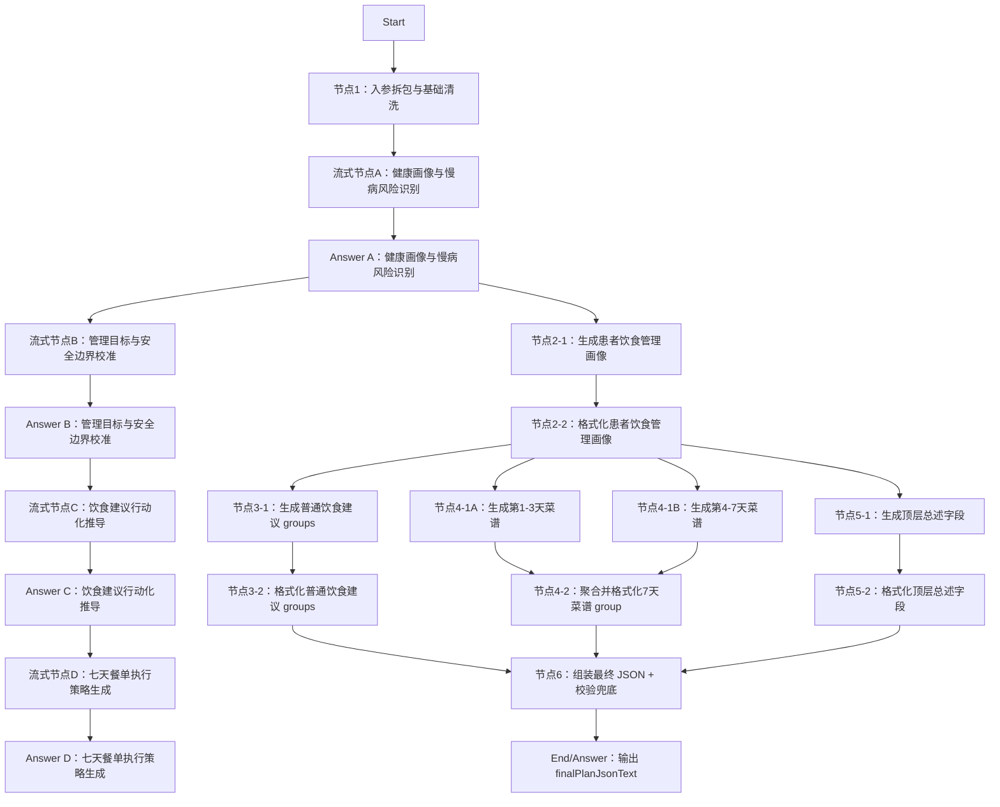

# DIFY工程-AI干预方案-饮食方案

## 工程定位

本工程用于在 DIFY 中搭建“AI 干预方案-饮食方案”分支。工作流接收患者基础档案、专病档案、近 1 年随访/指标/饮食/运动/取药记录、当前控制目标和健管师本次方案要求，输出可供 H5 渲染、健管师审阅修改的标准化饮食方案 JSON，并在等待期间输出用户可见的流式阶段分析。

本工程对应总入参 `planType=diet`。

本目录同时包含结构化 JSON 生成节点和 Chatflow 流式展示节点。测试数据只保留一套，统一放在 `测试数据/`。

## 节点总览



说明：流式节点只输出自然语言过程展示，不参与最终 JSON 拼装；结构化节点仍负责生成、格式化和组装最终 `finalPlanJsonText`。

## Start 入参建议

```json
{
  "planType": "diet",
  "planGoalAndRequirements": "",
  "extraSupplement": "",
  "basicProfile": {},
  "diseaseProfile": {},
  "followupRecordsLast1y": [],
  "metricRecordsLast1y": [],
  "dietRecordsLast1y": [],
  "exerciseRecordsLast1y": [],
  "medPickupRecords1y": [],
  "activeControlGoals": []
}
```

## 最终输出

节点6输出：

```json
{
  "finalPlanJsonText": "{\"planName\":\"饮食健康处方\",\"planTitle\":\"个性化饮食管理建议\",\"planSummary\":\"方案概述\",\"executionPoints\":\"执行要点\",\"groups\":[]}",
  "validationErrors": "[]",
  "validationErrorsCount": 0,
  "groupsCount": 0
}
```

建议 End 节点直接返回 `finalPlanJsonText`。该字段是 JSON 字符串，下游 H5 或接口需按 JSON 解析后渲染。

## 编排要点

- 节点1做输入清洗、字段兜底、记录截断和 `planType` 路由提示，不做业务判断。
- 节点2-1生成“患者饮食管理画像”，同时完成饮食目的识别、证据摘要和个性化生成提示；当前 Dify 工程默认不开启结构化输出，LLM 只输出合法 JSON 文本。
- 节点2-2格式化画像出参，当前 yml 实际绑定 `llmText <= 节点2-1.text`，输出同名稳定字段供节点3/4/5引用。
- 节点2不直接生成患者建议正文，但必须保留疾病指标、饮食行为、执行障碍、安全约束、能量平衡、用药提醒、可保留习惯、优先管理重点和缺失信息。
- 节点3-1生成普通饮食建议 `groups/items`，普通建议 group 使用 `groupType=adviceList`。
- 节点3-2格式化普通建议出参，固定 `groupType/itemType`，输出可供节点6引用的 `groups` 字符串。
- 节点4-1A生成第1-3天菜谱，节点4-1B生成第4-7天菜谱；两个节点并行执行，降低单个 LLM 节点输出耗时。
- 节点4-2聚合并格式化两段菜谱出参，固定 `groupType/displayStyle`，输出可供节点6引用的 `mealPlanGroup` 字符串。
- 节点5-1基于节点2画像生成顶层文案字段，和节点3、节点4并行执行；文案使用保守总述，不依赖普通建议和菜谱的实际输出。
- 节点5-2格式化顶层文案出参，输出节点6建议引用的 `planHeader` 字符串。
- 节点6负责最终拼装、字段兜底和结构校验，不生成业务内容。
- 流式节点A-D分别展示健康画像、目标与安全边界、饮食建议推导、七天餐单策略；每个流式节点后接 Answer，用于在 `/chat-messages` SSE 中推送过程内容。
- 面向用户的流式输出不暴露结构化 JSON、schema、代码节点日志和提示词工程细节。

## 流式输出设计

| 流式节点 | 触发时机 | 展示重点 |
| --- | --- | --- |
| 流式节点A：健康画像与慢病风险识别 | 入参清洗后 | 正在分析基础健康信息、慢病风险、近期指标、饮食行为和安全约束 |
| 流式节点B：管理目标与安全边界校准 | 健康画像输出后 | 校准控糖、控脂、减重等目标优先级，以及低血糖、用药、肾功能等安全边界 |
| 流式节点C：饮食建议行动化推导 | 目标校准后 | 说明如何把画像转成可执行饮食动作，例如主食份量、进餐顺序、优质蛋白和控油控盐 |
| 流式节点D：七天餐单执行策略生成 | 饮食建议推导后 | 说明 7 天餐单如何兼顾疾病目标、营养搭配、执行难度和长期坚持 |

流式输出建议控制在 80-140 字的自然段，像健管师解释“正在看什么、正在判断什么、接下来如何取舍”，不提前展开完整建议清单。

## 文件结构

联调 demo 位于 `../../demo/`，用于统一测试整个干预方案 V3 Chatflow。

```text
DIFY工程-AI干预方案-饮食方案/
  README.md
  节点1-入参拆包与基础清洗/
    代码-入参拆包与基础清洗.py
    【代码出入参说明】代码-入参拆包与基础清洗.md
  节点2-患者饮食管理画像/
    【prompt】生成患者饮食管理画像
    【结构化输出】患者饮食管理画像.schema.json
    代码-格式化患者饮食管理画像.py
    【代码出入参说明】代码-格式化患者饮食管理画像.md
  节点3-生成普通饮食建议groups/
    【prompt】生成普通饮食建议groups
    代码-格式化普通饮食建议groups.py
    【代码出入参说明】代码-格式化普通饮食建议groups.md
  节点4-生成7天菜谱group/
    【prompt】生成第1-3天菜谱group
    【prompt】生成第4-7天菜谱group
    代码-格式化7天菜谱group.py
    【代码出入参说明】代码-格式化7天菜谱group.md
  节点5-生成顶层总述字段/
    【prompt】生成顶层总述字段
    代码-格式化顶层总述字段.py
    【代码出入参说明】代码-格式化顶层总述字段.md
  节点6-组装最终JSON+校验兜底/
    代码-组装最终JSON+校验兜底.py
    【代码出入参说明】代码-组装最终JSON+校验兜底.md
  流式节点A-健康画像与慢病风险识别/
    【prompt】健康画像与慢病风险识别
  流式节点B-管理目标与安全边界校准/
    【prompt】管理目标与安全边界校准
  流式节点C-饮食建议行动化推导/
    【prompt】饮食建议行动化推导
  流式节点D-七天餐单执行策略生成/
    【prompt】七天餐单执行策略生成
  测试数据/
    【入参】饮食方案工作流测试入参.json
    【出参示例】饮食方案最终JSON.json
```
