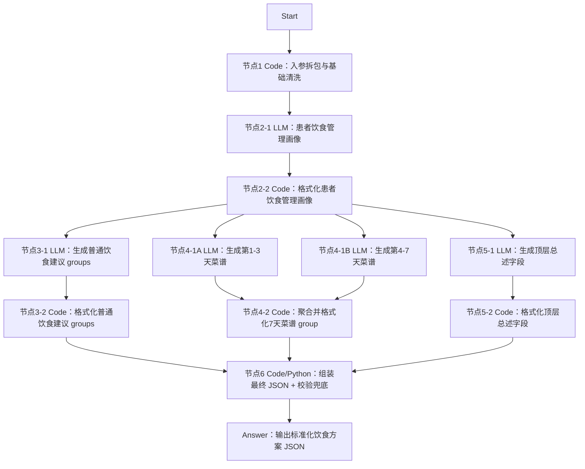

# Dify 工作流设计

## 工作流定位

该工作流面向健管师使用，不直接和患者多轮聊天采集档案。

当前专题定位是“饮食健康处方生成”，工作流会根据患者档案、近1年管理记录、当前控制目标和本次方案要求，生成一份以饮食干预为核心的结构化方案 JSON，供健管师审阅修改后交给 H5 页面渲染。

## 设计原则

- 节点数量控制在可维护范围内，避免为了“工程化”拆出过多中间节点。
- 节点2不做简单摘要，而是生成“患者饮食管理画像”，保留个性化管理细节。
- 菜谱单独由 LLM 节点生成，避免 7 天三餐结构和普通建议互相干扰。
- 最终方案文案生成和 JSON 组装校验分离，LLM 负责内容，Code 节点负责拼装、补默认值和结构校验。
- 最终出参保持标准化顶层结构，不为饮食方案新增顶层字段；个性化展示通过 `groups[].groupType` 和 group/item 扩展字段表达。
- 最终 JSON 同一层级字段集合保持一致：不同 `groupType` 的 group、不同 `itemType` 的 item 都补齐同名字段，没有值时输出空字符串、空数组或空对象。

## 输入参数建议

建议 Start 节点接收以下参数：

```json
{
  "planType": "diet",
  "planGoalAndRequirements": "",
  "extraSupplement": "",
  "basicProfile": {},
  "diseaseProfile": {},
  "followupRecordsLast1y": [],
  "metricRecordsLast1y": [],
  "dietRecordsLast1y": [],
  "exerciseRecordsLast1y": [],
  "medPickupRecords1y": [],
  "activeControlGoals": []
}
```

说明：

- `exerciseRecordsLast1y` 虽然不是饮食记录，但可作为体重管理、能量消耗和生活方式执行能力的辅助判断依据。
- `medPickupRecords1y` 主要用于辅助判断依从性、低血糖风险、饮食建议边界和是否需要更保守的控糖建议表达。
- `planType` 为总入口路由字段，饮食方案工程固定按 `diet` 处理。

## 推荐节点拓扑



## 节点职责设计

### 1）Code/Template：入参拆包与基础清洗

职责：

- 对 Start 入参做空值兜底、字段重命名、过长数组截断策略和明显脏数据剔除。
- 解析对象/数组 JSON 字符串后，递归把内部下划线字段归一为驼峰字段，兼容上游暂未完全改造的传参。
- 按节点2需要构造 `medicalGoalContext`、`dietExecutionContext`、`safetyEnergyContext`。
- 带出 `planType` 和 `routeWarning`，提醒调用方检查路由。
- 不做业务判断，不直接生成建议。

建议输出：

```json
{
  "medicalGoalContext": {},
  "dietExecutionContext": {},
  "safetyEnergyContext": {},
  "planGoalAndRequirements": "",
  "extraSupplement": "",
  "planType": "diet",
  "routeWarning": "",
  "inputStats": {}
}
```

### 2）患者饮食管理画像

节点2建议由两个子节点组成：

- **节点2-1 LLM：生成患者饮食管理画像**
- **节点2-2 Code：格式化患者饮食管理画像**

#### 2-1）LLM：生成患者饮食管理画像

职责：

- 一次性读取节点1整理后的三类上下文。
- 识别本次饮食方案目的，例如减重、控糖、优化代谢、术后康复等。
- 在 DIFY 中开启结构化输出，输出可被后续节点直接引用的个性化管理画像，而不是只输出一段摘要或把 JSON 放进 `text`。
- 不直接生成患者建议正文。

结构化输出配置：

- 结构化输出 schema 见 `节点2-患者饮食管理画像/【结构化输出】患者饮食管理画像.schema.json`。
- 节点2-1的结构化输出先进入节点2-2格式化代码；后续节点直接引用 `{{#节点2-2.dietPlanGoal#}}`、`{{#节点2-2.patientContextPack#}}`、`{{#节点2-2.materialSummaryBundle#}}` 等字段。
- 不建议让后续节点从 `{{#节点2.text#}}` 中解析整段 JSON，稳定性较差。

建议输出：

```json
{
  "dietPlanGoal": "mixed",
  "dietPlanGoalLabel": "减重控糖",
  "goalBasis": "本次方案要求中同时出现减重和控糖诉求，且素材显示患者存在餐后血糖波动和体重管理压力。",
  "patientContextPack": {
    "diseaseAndMetricProfile": [
      {
        "evidence": "近1年指标记录显示餐后血糖波动。",
        "impact": "饮食方案需要优先控制主食总量、碳水类型和进餐顺序。",
        "generationHint": "普通建议中设置主食与血糖管理分组；菜谱中避免高糖饮品和大份精制主食。"
      }
    ],
    "dietBehaviorPatterns": [],
    "executionBarriers": [],
    "safetyConstraints": [],
    "energyBalanceClues": [],
    "medicationRelatedCautions": [],
    "positiveHabitsToKeep": [],
    "priorityManagementFocus": [],
    "missingInformation": []
  },
  "materialSummaryBundle": {
    "medicalGoalSummary": "",
    "dietExecutionSummary": "",
    "safetyEnergySummary": ""
  }
}
```

画像要求：

- 每个数组建议 1-5 条。
- 每条尽量包含 `evidence`、`impact`、`generationHint`。
- `priorityManagementFocus` 必须输出 3-5 条，作为后续普通建议和菜谱生成的核心依据。
- 对信息缺失要明确写入 `missingInformation`，不要通过编造补齐。
- `dietPlanGoal` 是流程内部判断字段，用于指导节点3/4/5生成内容，不进入最终标准 JSON；最终菜谱 group 只保留 `dietPlanGoalLabel` 和 `goalBasis`。
- 不要做超过证据的医学判断、不要建议调整药物/剂量/用药时间、不要让 `generationHint` 要求后续输出当前协议没有的字段。

#### 2-2）Code：格式化患者饮食管理画像

职责：

- 放在节点2-1 LLM 之后。
- 兼容结构化输出字段，也兼容未开启结构化输出时的 `text` JSON。
- 合法化 `dietPlanGoal`，补齐 `dietPlanGoalLabel`、`goalBasis`。
- 补齐 `patientContextPack` 的 9 个固定维度，保证每条 item 至少包含 `evidence`、`impact`、`generationHint`。
- 将 `patientContextPack`、`materialSummaryBundle`、`formattedProfileJson` 输出为 JSON 字符串，方便后续 LLM 节点引用。

建议后续节点引用节点2-2的同名输出字段：

```text
{{#节点2-2.dietPlanGoal#}}
{{#节点2-2.dietPlanGoalLabel#}}
{{#节点2-2.goalBasis#}}
{{#节点2-2.patientContextPack#}}
{{#节点2-2.materialSummaryBundle#}}
```

### 3）生成普通饮食建议 groups

节点3建议由两个子节点组成：

- **节点3-1 LLM：生成普通饮食建议 groups**
- **节点3-2 Code：格式化普通饮食建议 groups**

#### 3-1）LLM：生成普通饮食建议 groups

职责：

- 根据节点2-2的 `patientContextPack` 生成普通饮食建议。
- 优先使用 `priorityManagementFocus`，选择 2-4 个最重要的普通建议 group。
- 不生成 7 天菜谱。

建议输出：

```json
{
  "groups": [
    {
      "groupTitle": "主食与血糖管理",
      "groupType": "adviceList",
      "groupSummary": "围绕主食份量、粗细搭配和餐后血糖波动控制生成建议。",
      "displayStyle": "list",
      "items": [
        {
          "itemType": "advice",
          "title": "固定主食份量",
          "content": "每餐主食优先选择全谷物、杂豆或薯类替代部分精白米面，并控制单餐总量。",
          "focusPoint": "重点降低餐后血糖波动；如近期出现低血糖或胃肠不适，应逐步调整粗杂粮比例。",
          "importance": "重点执行"
        }
      ]
    }
  ]
}
```

生成要求：

- `content` 必须具体、短句、可执行。
- `focusPoint` 说明依据、注意事项、适用边界和风险提醒。
- 必须吸收执行障碍、安全约束、可保留习惯和缺失信息，避免泛泛而谈。
- `importance` 只能取 `重点执行` / `常规建议` / `补充建议`。

#### 3-2）Code：格式化普通饮食建议 groups

职责：

- 放在节点3-1 LLM 之后。
- 兼容结构化输出字段，也兼容未开启结构化输出时的 `text` JSON。
- 固定普通建议 group 的 `groupType=adviceList`。
- 固定普通建议 item 的 `itemType=advice`。
- 跳过误输出的 `weeklyMealPlan`，避免普通建议节点侵入节点4职责。
- 将格式化后的 `groups` 输出为 JSON 字符串，方便节点5和节点6引用。
- 将缺少 group 标题、item 内容、非法 importance 等问题写入 `formatWarnings`，最终严格校验仍由节点6完成。

建议后续节点引用节点3-2输出：

```text
{{#节点3-2.groups#}}
```

### 4）生成最近 7 天菜谱 group

节点4建议由三个子节点组成：

- **节点4-1A LLM：生成第1-3天菜谱 group**
- **节点4-1B LLM：生成第4-7天菜谱 group**
- **节点4-2 Code：聚合并格式化7天菜谱 group**

#### 4-1A/4-1B）LLM：分段生成最近 7 天菜谱 group

职责：

- 根据节点2识别出的饮食目的和患者画像，分段生成 `groupType=weeklyMealPlan` 的菜谱分组。
- 节点4-1A只输出 day=1-3，节点4-1B只输出 day=4-7。
- 两个 LLM 节点并行执行，降低单个节点输出耗时。
- 与节点3普通建议并行生成，职责只聚焦菜谱；最终一致性由节点5总述和节点6组装校验兜底。

建议输出：

```json
{
  "mealPlanGroup": {
    "groupTitle": "最近7天饮食执行菜谱",
    "groupType": "weeklyMealPlan",
    "groupSummary": "按减重控糖目标安排7天三餐，日均约1600千卡。",
    "displayStyle": "weeklyMealPlan",
    "dietPlanGoalLabel": "减重控糖",
    "goalBasis": "方案目标明确要求控制血糖、减重；患者体重偏高且外卖频率较高。",
    "items": []
  }
}
```

生成要求：

- 节点4-1A必须输出 3 天，节点4-1B必须输出 4 天；合并后必须覆盖 day=1-7。
- 每天必须包含早餐、午餐、晚餐。
- `mealName` 只能使用 `早餐`、`午餐`、`晚餐`、`加餐`、`夜班加餐`；食堂、外卖、夜班等场景放在 `mealScene`。
- 每餐必须包含食物名称、克重、热量、蛋白质、脂肪。
- 每天必须有 `dailyTotalKcal`、`dailyTotalProteinG`、`dailyTotalFatG`。
- 如果目标包含减重，每天输出 `estimatedEnergyDeficitKcal`。
- 必须结合患者执行障碍，例如夜班、外卖、不会做饭、工作餐等场景。

#### 4-2）Code：格式化7天菜谱 group

职责：

- 放在节点4-1A和节点4-1B LLM 之后。
- 兼容结构化输出字段，也兼容未开启结构化输出时的 `text` JSON。
- 合并第1-3天和第4-7天菜谱，按 `day` 升序排序，重复天数保留首次出现。
- 固定 `groupType=weeklyMealPlan` 和 `displayStyle=weeklyMealPlan`。
- 归一每天、每餐和每个食物的核心字段，输出节点5和节点6可直接引用的 `mealPlanGroup` 字符串。
- 将非 7 天、缺少三餐、缺少有效食物等问题写入 `formatWarnings`，最终严格校验仍由节点6完成。

建议后续节点引用节点4-2输出：

```text
{{#节点4-2.mealPlanGroup#}}
```

### 5）生成顶层总述字段

节点5建议由两个子节点组成：

- **节点5-1 LLM：生成顶层总述字段**
- **节点5-2 Code：格式化顶层总述字段**

#### 5-1）LLM：生成顶层总述字段

职责：

- 根据节点2画像生成最终 JSON 顶层文案字段。
- 与节点3普通建议和节点4菜谱并行执行，因此文案使用保守总述，不依赖后两者的实际输出。
- 不负责生成 group 或 item。

建议输出：

```json
{
  "planName": "饮食健康处方",
  "planTitle": "个性化饮食管理建议",
  "planSummary": "结合当前疾病情况、近期指标变化和日常饮食习惯，本方案从主食选择、蛋白质搭配、控盐控油和外食策略等方面提供可执行的饮食调整建议。",
  "executionPoints": "优先落实重点执行条目；饮食调整以循序渐进、可长期坚持为原则；如出现明显不适、连续指标异常或与医生治疗要求冲突，应及时联系医生或健管师。"
}
```

生成要求：

- `planSummary` 要概括为什么这样安排、主要围绕哪些饮食方向、预期帮助什么问题。
- 如果存在 7 天菜谱，要明确提到“最近7天执行菜谱”。
- `executionPoints` 要强调优先级、记录/反馈要求、安全边界和何时联系医生或健管师。
- 顶层文案必须和节点2画像保持一致，不编造节点2没有依据的模块、目标或事实。

#### 5-2）Code：格式化顶层总述字段

职责：

- 放在节点5-1 LLM 之后。
- 兼容结构化输出字段，也兼容未开启结构化输出时的 `text` JSON。
- 兜底 `planName`、`planTitle`、`planSummary`、`executionPoints`。
- 输出节点6建议引用的 `planHeader` 字符串。
- 对“患者”“该患者”“结合患者情况”“制造热量缺口”等偏病历或内部表达写入 `formatWarnings`，便于调试时发现患者端口吻问题。

建议节点6引用节点5-2输出：

```text
{{#节点5-2.planHeader#}}
```

### 6）Code/Python：组装最终 JSON + 校验 + 兜底

职责：

- 将节点5-2顶层总述字段、节点3-2普通建议和节点4-2菜谱组装为最终标准 JSON。
- 将 `mealPlanGroup` 追加到最终 `groups`。
- 补齐缺失顶层字段和数组字段。
- 按层级补齐字段集合，保证所有 group 字段数量一致、所有 item 字段数量一致；meal 和 food 层也按同层级字段补齐。
- 将非法或缺失的 `importance` 统一归一到 `常规建议`。
- 对空文本字段做兜底，避免 H5 模板渲染异常。
- 对 `groupType=weeklyMealPlan` 做 7 天、三餐和营养字段校验。
- 返回可定位的 `validationErrors`，或降级输出最小可渲染 JSON。

建议最终输出：

```json
{
  "finalPlanJsonText": "{\"planName\":\"饮食健康处方\",\"planTitle\":\"个性化饮食管理建议\",\"planSummary\":\"方案概述\",\"executionPoints\":\"执行要点\",\"groups\":[]}",
  "validationErrors": "[]",
  "validationErrorsCount": 0,
  "groupsCount": 0
}
```

说明：Dify Code 节点对返回 Object 的层级有限制，最终方案包含 `groups.items.meals.foods` 等深层结构，因此节点6只返回 `finalPlanJsonText` 字符串，不直接返回深层 Object。节点6输出前会统一补齐同层级字段，例如普通建议 group 也会带空的 `dietPlanGoalLabel`、`goalBasis`，普通建议 item 也会带空的 `day`、`dailyTotalKcal`、`meals` 等菜谱字段。

## 串并行建议

- 节点2必须在节点1之后执行。
- 节点3-1依赖节点2-2。
- 节点4-1A和节点4-1B都依赖节点2-2，二者和节点3-1/3-2可并行执行。
- 节点5-1依赖节点2-2，和节点3、节点4并行执行。
- 节点6必须放在最后统一处理组装、兜底和校验。

## 风险与注意事项

- 如果节点2过度总结，后续会丢失关键个性化依据；因此节点2必须输出 `evidence`、`impact`、`generationHint` 三段式画像。
- 如果节点3普通建议过多，H5 页面会显得啰嗦；建议控制在 2-4 个普通建议 group。
- 如果节点4菜谱没有结合执行障碍，方案会变成“看起来正确但做不到”；菜谱 prompt 必须要求外食、夜班、工作餐等场景适配。
- 如果各 LLM 节点输出格式不稳定，优先在 Code 节点做 JSON 解析和字段兜底，同时在 Prompt 中明确“只输出 JSON”。
- 饮食处方内容属于健康管理建议，不替代医生诊断、处方药调整和急症处理决策；涉及明显异常指标、疑似禁忌或高风险情况时，应在 `focusPoint` 和 `executionPoints` 中提示及时联系医生或健管师。

## LLM 节点专业经验要求

| LLM节点 | 主要任务 | 需要的专业医学/健管经验 | 经验重点 |
| --- | --- | --- | --- |
| 患者饮食管理画像 | 从所有输入中识别饮食目的、个性化证据、执行障碍、安全边界和生成提示 | 慢病基础医学、指标解读、饮食行为评估、患者依从性分析、用药安全、能量平衡 | 保留后续生成真正需要的个性化抓手，而不是只做泛泛摘要 |
| 生成普通饮食建议 groups | 生成普通建议分组和具体可执行条目 | 临床营养干预、慢病饮食管理、患者教育表达、风险边界表达 | 把画像证据转成患者能照做、健管师能审阅的建议 |
| 生成最近 7 天菜谱 group | 生成三餐菜谱、克重、热量、蛋白质、脂肪和减重热量缺口 | 营养配餐、慢病饮食管理、控糖减重、场景化执行设计 | 让方案具备执行力，不停留在说教 |
| 生成顶层总述字段 | 生成 `planName`、`planTitle`、`planSummary`、`executionPoints` | 健康管理文案、风险沟通、方案一致性把控 | 用简洁语言概括方案目标、执行原则和安全边界 |
