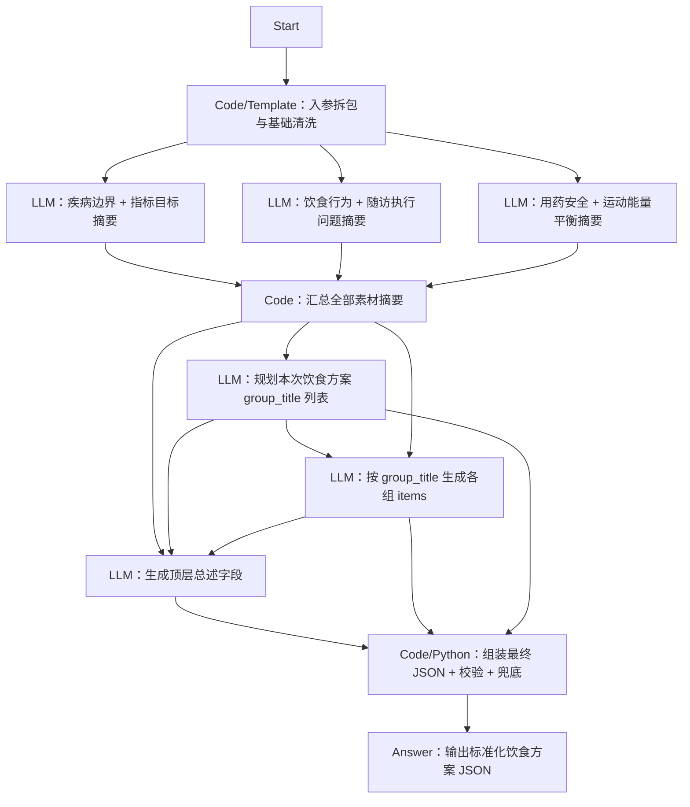

# Dify 工作流设计

## 工作流定位

该工作流面向健管师使用，不直接和患者多轮聊天采集档案。

当前专题定位是“饮食健康处方生成”，工作流会根据患者档案、近1年管理记录、当前控制目标和本次方案要求，生成一份以饮食干预为核心的结构化方案 JSON，供健管师审阅修改后交给 H5 页面渲染。

## 设计原则

- 不将全部原始入参直接一次性塞入单个 LLM 节点，先按“饮食处方决策维度”做素材压缩和证据整理；对存在内在关联的数据源，允许在同一摘要节点内联合分析，不按原始表机械拆分。
- 中间层尽量输出结构化 JSON，不输出大段自由文本，方便后续节点稳定消费。
- `groups` 不再固定为“饮食干预/运动干预/控制目标/监测方案”，而是围绕本次饮食专题动态生成若干饮食子分组。
- 最终方案文案生成和 JSON 组装校验分离，LLM 负责生成内容，Code 节点负责拼装、补默认值和 schema 校验。

## 输入参数建议

建议 Start 节点接收以下参数：

```json
{
  "plan_type": "diet",
  "plan_goal_and_requirements": "",
  "extra_supplement": "",
  "basic_profile": {},
  "disease_profile": {},
  "followup_records_last_1y": [],
  "metric_records_last_1y": [],
  "diet_records_last_1y": [],
  "exercise_records_last_1y": [],
  "med_pickup_records_1y": [],
  "active_control_goals": []
}
```

说明：

- `exercise_records_last_1y` 虽然不是饮食记录，但可作为体重管理、能量消耗和生活方式执行能力的辅助判断依据。
- `med_pickup_records_1y` 主要用于辅助判断依从性、低血糖风险、饮食建议边界和是否需要更保守的控糖建议表达。
- `plan_type` 为总入口路由字段，饮食方案工程固定按 `diet` 处理。

## 推荐节点拓扑



## 节点职责设计

### 1）Code/Template：入参拆包与基础清洗

职责：

- 对 Start 入参做空值兜底、字段重命名、过长数组截断策略、时间范围过滤和明显脏数据剔除。
- 按后续素材整理节点需要，分别构造各节点输入上下文，避免每个素材节点都重复拿全量原始数据。

建议输出：

```json
{
  "medical_goal_context": {},
  "diet_execution_context": {},
  "safety_energy_context": {},
  "plan_goal_and_requirements": "",
  "extra_supplement": ""
}
```

### 2）LLM：按饮食决策维度拆分的素材摘要节点

这类节点建议并行执行。节点边界不按“原始数据表来源”机械切分，而按“生成饮食处方时要回答的关键判断问题”拆分；凡是需要联合判断才有意义的强相关信息，尽量放在同一摘要节点内处理。

这些节点只输出面向下游 LLM 的自然语言摘要，不直接生成最终患者建议文案；摘要里需要包含关键结论、依据、风险边界和明显缺失信息，但不必拆成大量细字段。

#### 疾病边界 + 指标目标摘要

输入建议：

```json
{
  "basic_profile": {},
  "disease_profile": {},
  "metric_records_last_1y": [],
  "active_control_goals": [],
  "plan_goal_and_requirements": "",
  "extra_supplement": ""
}
```

输出建议：

```json
{
  "summary_text": "用一段自然语言概括患者基础疾病背景、关键异常指标与趋势、当前控制目标、饮食干预优先级、明确禁忌/慎用边界、需要特别提醒的风险点，以及当前缺失但会影响饮食处方判断的信息。"
}
```

#### 饮食行为 + 随访执行问题摘要

输入建议：

```json
{
  "diet_records_last_1y": [],
  "followup_records_last_1y": [],
  "plan_goal_and_requirements": "",
  "extra_supplement": ""
}
```

输出建议：

```json
{
  "summary_text": "用一段自然语言概括患者当前饮食模式、最主要的饮食问题、典型问题场景、可保留的好习惯、随访中反映的执行障碍/依从性问题、本次最值得优先调整的饮食方向，以及缺失信息。"
}
```

#### 用药安全 + 运动能量平衡摘要

输入建议：

```json
{
  "med_pickup_records_1y": [],
  "exercise_records_last_1y": [],
  "metric_records_last_1y": [],
  "followup_records_last_1y": [],
  "disease_profile": {}
}
```

输出建议：

```json
{
  "summary_text": "用一段自然语言概括用药领取/治疗连续性、疑似低血糖或其他饮食调整安全风险、运动活动水平和体重/能量平衡含义、因此对饮食热量和碳水调整有哪些约束，以及需要提醒患者加强监测或及时反馈的情况。"
}
```

### 3）Code：汇总全部素材摘要

职责：

- 收集所有素材整理节点输出，统一包装成一个 `material_summary_bundle`。
- 检查各节点是否返回合法 JSON；若某个节点失败，填入空摘要和错误标记，避免整条工作流直接中断。

建议输出：

```json
{
  "plan_goal_and_requirements": "",
  "extra_supplement": "",
  "material_summary_bundle": {
    "medical_goal_summary": "",
    "diet_execution_summary": "",
    "safety_energy_summary": ""
  }
}
```

### 4）LLM：规划本次饮食方案 group_title 列表

该节点只负责“本次饮食处方应该分成哪几个饮食子组，以及每组重点写什么”，不直接生成完整 items。

输入建议：

```json
{
  "plan_goal_and_requirements": "",
  "extra_supplement": "",
  "material_summary_bundle": {}
}
```

输出建议：

```json
{
  "group_plan": [
    {
      "group_title": "饮食总原则",
      "group_focus": "说明本次饮食调整的总体方向、优先级和最重要的执行边界"
    },
    {
      "group_title": "主食与血糖管理",
      "group_focus": "围绕主食份量、类型、进餐顺序和餐后血糖波动控制生成建议"
    }
  ]
}
```

分组建议：

- `group_title` 应围绕饮食专题组织，例如“饮食总原则”“主食与血糖管理”“蛋白质选择”“控盐控油与烹饪方式”“外食与聚餐策略”“饮食监测与风险提醒”等。
- 不要求每次固定输出同一套分组，但建议控制在 4-8 组，避免页面过长。
- 如果用户本次只要求某个细分方向，例如“低嘌呤饮食”或“减重控糖早餐方案”，分组应向该主题收敛，而不是机械铺满所有营养模块。

### 5）LLM：按 group_title 生成各组 items

该节点根据 `group_plan` 和 `material_summary_bundle` 生成每个饮食分组下的建议条目。

实现方式有两种：

- **方式 A：单个 LLM 节点一次性生成所有 groups 的 items**
  - 优点：工作流结构简单，组间风格更容易统一。
  - 缺点：如果 `group_plan` 较多或素材摘要较长，单节点 prompt 仍可能偏大。
- **方式 B：按 group_plan 循环/分批调用 LLM，每次只生成一个或少量 group 的 items**
  - 优点：更适合长方案，单次上下文更小，某一组质量问题更容易重试。
  - 缺点：工作流编排更复杂，需由 Code 节点负责多次结果汇总。

当前建议优先采用方式 A 起步；如果后续发现单次上下文过大或某些分组质量不稳定，再升级为方式 B。

输出结构必须贴近最终 `groups`：

```json
{
  "groups": [
    {
      "group_title": "主食与血糖管理",
      "items": [
        {
          "content": "每餐主食优先选择全谷物、杂豆、薯类替代部分精白米面，并控制单餐总量。",
          "focus_point": "重点降低餐后血糖波动；若近期有低血糖或胃肠不适，应逐步调整粗杂粮比例。",
          "importance": "重点执行"
        }
      ]
    }
  ]
}
```

生成要求：

- 每条 `content` 必须是患者能直接执行的饮食建议，尽量具体、短句、可落地。
- `focus_point` 负责解释原因、注意事项、安全边界、适用条件，不要和 `content` 简单重复。
- `importance` 只能取 `重点执行` / `常规建议` / `补充建议`。
- 不要编造素材摘要中完全没有依据的疾病史、指标值、用药事实或饮食习惯。
- 如果某组缺乏足够证据，也可以生成较保守的通用建议，但应在 `focus_point` 中明确“需结合后续记录/复诊进一步调整”。

### 6）LLM：生成顶层总述字段

该节点只生成最终 JSON 的顶层文案字段，不负责生成各组 items。

输入建议：

```json
{
  "plan_goal_and_requirements": "",
  "extra_supplement": "",
  "material_summary_bundle": {},
  "group_plan": [],
  "groups": []
}
```

输出建议：

```json
{
  "plan_name": "饮食健康处方",
  "plan_title": "个性化饮食管理建议",
  "plan_summary": "结合当前疾病情况、近期指标变化和日常饮食习惯，本方案从主食选择、蛋白质搭配、控盐控油和外食策略等方面提供可执行的饮食调整建议。",
  "execution_points": "优先落实重点执行条目；饮食调整以循序渐进、可长期坚持为原则；如出现明显不适、连续指标异常或与医生治疗要求冲突，应及时联系医生或健管师。"
}
```

生成要求：

- `plan_summary` 要概括“为什么这样安排、主要围绕哪些饮食方向、预期帮助什么问题”。
- `execution_points` 要强调优先级、执行原则、风险边界和何时反馈，不要复述每个具体条目。
- 顶层文案应和实际 `groups/items` 保持一致，不要写出方案中不存在的模块。

### 7）Code/Python：组装最终 JSON + 校验 + 兜底

职责：

- 将顶层总述字段、`group_plan` 和 `groups/items` 组装为最终标准 JSON。
- 以 `group_plan` 的顺序为准对 groups 排序；如某个规划分组没有生成 items，可选择丢弃空组或填入兜底提示条目。
- 补齐缺失顶层字段和数组字段。
- 将非法或缺失的 `importance` 统一归一到 `常规建议`。
- 对空文本字段做兜底，避免 H5 模板渲染异常。
- 按 `schema/intervention-plan.schema.json` 做最终结构校验；校验失败时返回可定位的错误信息，或降级输出最小可渲染 JSON。

建议最终输出结构：

```json
{
  "plan_name": "饮食健康处方",
  "plan_title": "个性化饮食管理建议",
  "plan_summary": "方案概述",
  "execution_points": "执行要点",
  "groups": [
    {
      "group_title": "主食与血糖管理",
      "items": [
        {
          "content": "具体建议/目标/执行方式",
          "focus_point": "解释说明、注意事项、依据",
          "importance": "重点执行"
        }
      ]
    }
  ]
}
```

## 推荐 Prompt 框架

### 素材整理类 LLM 节点 Prompt

```text
你是一名慢病饮食处方素材整理助手。

请只根据当前输入的这一类数据，提取“对饮食方案生成有价值的结构化证据摘要”，不要直接生成最终患者饮食建议正文。

要求：
1. 只输出合法 JSON 对象，不要输出 Markdown、解释文字或 HTML。
2. 严格按本节点约定字段输出，只返回 `summary_text` 一个字段，不要额外扩展字段。
3. `summary_text` 里要尽量保留可追溯依据，例如时间、指标趋势、随访结论、饮食行为特征等，同时写清楚关键风险边界。
4. 会影响饮食处方质量但当前输入缺失的信息，也直接写进 `summary_text` 末尾。
5. 如果输入数据为空，返回 `{"summary_text": "本节点输入为空，暂无可提炼摘要。"}`，不要硬编内容。

输入数据：
{{ node_input_json }}
```

### group_title 规划 LLM 节点 Prompt

```text
你是一名饮食健康处方结构规划助手。

请根据健管师本次方案目标、额外要求和全部素材摘要，规划本次饮食处方适合拆成哪些 group_title 分组，以及每组重点写什么。

要求：
1. 只输出合法 JSON 对象，不要输出 Markdown、解释文字或 HTML。
2. 输出字段固定为 group_plan，group_plan 是数组。
3. 每个分组对象必须包含 group_title、group_focus。
4. group_title 必须围绕“饮食方案专题”组织，不要输出“运动干预”“监测方案”这类偏离饮食专题的大组标题。
5. 分组数量建议 4-8 个；如果本次需求明显聚焦某个细分主题，可以更少，但不要机械铺满所有营养模块。
6. group_focus 要说明该组应该写哪些类型的建议、应重点解决什么问题、要注意哪些边界。
7. 不要编造素材摘要里完全没有依据的具体疾病史、指标值或生活习惯。

输入数据：
{{ material_summary_bundle_json }}
```

### groups/items 生成 LLM 节点 Prompt

```text
你是一名慢病饮食健康处方生成助手。

请根据本次饮食分组规划 group_plan、全部素材摘要、健管师方案目标和额外要求，为每个 group_title 生成面向患者展示、健管师可审阅修改的饮食建议 items。

要求：
1. 只输出合法 JSON 对象，不要输出 Markdown、解释文字或 HTML。
2. 输出字段固定为 groups，groups 是数组。
3. 每个 group 必须包含 group_title 和 items；group_title 应与 group_plan 保持一致。
4. 每个 item 必须包含 content、focus_point、importance。
5. importance 只能取 重点执行 / 常规建议 / 补充建议。
6. content 要写成患者可直接照做的饮食建议，具体、短句、可执行。
7. focus_point 负责补充原因、注意事项、适用边界、风险提醒，不要和 content 简单重复。
8. 优先结合当前控制目标、近期指标趋势、既往饮食问题和依从性信息，避免泛泛而谈。
9. 不要编造素材摘要中完全没有依据的疾病史、指标值、用药事实或饮食习惯。
10. 如存在安全边界、禁忌、低血糖风险、肾功能/胃肠耐受等个体化差异，请写入 focus_point。

输入数据：
{{ group_generation_input_json }}
```

### 顶层总述字段生成 LLM 节点 Prompt

```text
你是一名饮食健康处方总述文案生成助手。

请根据全部素材摘要、饮食分组规划和已生成的 groups/items，生成最终方案 JSON 的顶层字段 plan_name、plan_title、plan_summary、execution_points。

要求：
1. 只输出合法 JSON 对象，不要输出 Markdown、解释文字或 HTML。
2. 顶层字段必须且只需包含 plan_name、plan_title、plan_summary、execution_points。
3. plan_name 建议使用“饮食健康处方”或与本次专题一致的简短名称。
4. plan_title 应面向患者阅读，突出个体化饮食管理主题。
5. plan_summary 概括本方案主要围绕哪些饮食方向、为什么这样设计、预期帮助什么问题。
6. execution_points 说明优先执行原则、记录/反馈要求、安全边界和何时联系医生或健管师。
7. 文案必须和已生成 groups/items 保持一致，不要写出方案中不存在的模块或目标。
8. 不要编造素材摘要中完全没有依据的疾病史、指标值、用药事实。

输入数据：
{{ plan_header_input_json }}
```

## 串并行建议

- 3 个“按饮食决策维度拆分的素材摘要 LLM 节点”适合并行执行，减少整体耗时和模型调用成本。
- `group_title` 规划节点必须在素材摘要汇总之后执行。
- `groups/items` 生成节点必须在 `group_title` 规划之后执行。
- 顶层总述字段节点建议在 `groups/items` 生成之后执行，这样 `plan_summary` 和 `execution_points` 更容易与实际分组内容一致。
- 最终 JSON 组装、校验、兜底必须放在最后的 Code/Python 节点统一处理，不建议交给 LLM 自己完成。

## 风险与注意事项

- 如果素材整理节点过度总结，后续生成节点可能丢失关键证据；建议在 `summary_text` 中保留少量高价值原始依据片段、时间点和指标趋势，不要只写抽象结论。
- 如果 `group_title` 过于自由，H5 页面虽然能渲染，但运营/健管师可能难以形成稳定审阅习惯；建议保留一套“推荐分组词库”，由模型优先选用，必要时再新增自定义分组。
- 如果各 LLM 节点输出格式不稳定，优先在 Code 节点做 JSON 解析和字段兜底，同时在 Prompt 中明确“只输出 JSON”。
- 饮食处方内容属于健康管理建议，不替代医生诊断、处方药调整和急症处理决策；涉及明显异常指标、疑似禁忌或高风险情况时，应在 `focus_point` 和 `execution_points` 中提示及时联系医生或健管师。

## LLM 节点专业经验要求

| LLM节点 | 主要任务 | 需要的专业医学/健管经验 | 经验重点 |
| --- | --- | --- | --- |
| 疾病边界 + 指标目标摘要 | 从基础档案、专病档案、指标和控制目标中提炼饮食干预边界与优先级 | 慢病基础医学、指标解读、个体化目标管理、饮食禁忌识别、风险分层 | 判断哪些指标异常值得优先处理，哪些饮食建议有禁忌或需保守表达 |
| 饮食行为 + 随访执行问题摘要 | 从饮食记录和随访记录中识别当前饮食模式、问题场景和执行障碍 | 饮食行为评估、健康管理随访、患者依从性分析、场景化干预设计、患者教育经验 | 看懂患者平时怎么吃、哪里做不到、为什么做不到 |
| 用药安全 + 运动能量平衡摘要 | 从取药、运动、指标、随访中提炼饮食调整时的安全约束和能量平衡因素 | 用药安全、低血糖风险识别、运动与能量平衡、体重管理、监测与反馈管理 | 避免饮食建议与用药或运动状态冲突，识别需要加强监测的情况 |
| 规划本次饮食方案 `group_title` 列表 | 设计这次饮食处方的分组框架和每组关注点 | 饮食处方结构设计、健康管理方案组织、患者沟通、内容编排经验 | 知道一份饮食处方应该怎么分组，既专业又让患者看得懂 |
| 按 `group_title` 生成各组 `items` | 生成每个分组下的具体饮食建议和关注点 | 临床营养干预、慢病饮食管理、患者教育表达、风险边界表达、个体化处方经验 | 把专业判断写成具体、可执行、可审阅的饮食建议 |
| 生成顶层总述字段 | 生成 `plan_name`、`plan_title`、`plan_summary`、`execution_points` | 健康管理文案、风险沟通、方案一致性把控、患者沟通分寸感 | 用简洁语言概括方案目标、执行原则和风险提醒 |
