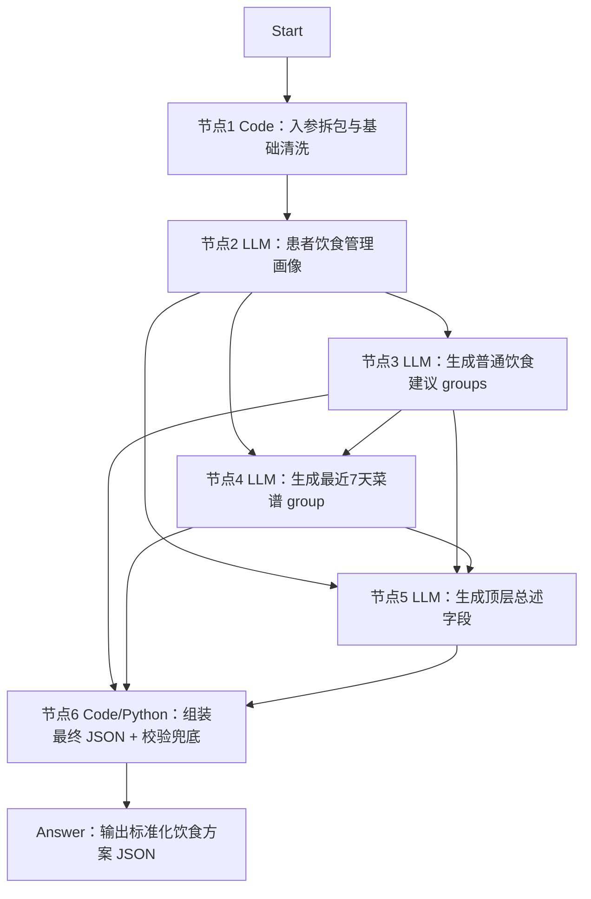

# Dify 工作流设计

## 工作流定位

该工作流面向健管师使用，不直接和患者多轮聊天采集档案。

当前专题定位是“饮食健康处方生成”，工作流会根据患者档案、近1年管理记录、当前控制目标和本次方案要求，生成一份以饮食干预为核心的结构化方案 JSON，供健管师审阅修改后交给 H5 页面渲染。

## 设计原则

- 节点数量控制在可维护范围内，避免为了“工程化”拆出过多中间节点。
- 节点2不做简单摘要，而是生成“患者饮食管理画像”，保留个性化管理细节。
- 菜谱单独由 LLM 节点生成，避免 7 天三餐结构和普通建议互相干扰。
- 最终方案文案生成和 JSON 组装校验分离，LLM 负责内容，Code 节点负责拼装、补默认值和结构校验。
- 最终出参保持标准化顶层结构，不为饮食方案新增顶层字段；个性化展示通过 `groups[].group_type` 和 group/item 扩展字段表达。

## 输入参数建议

建议 Start 节点接收以下参数：

```json
{
  "plan_type": "diet",
  "plan_goal_and_requirements": "",
  "extra_supplement": "",
  "basic_profile": {},
  "disease_profile": {},
  "followup_records_last_1y": [],
  "metric_records_last_1y": [],
  "diet_records_last_1y": [],
  "exercise_records_last_1y": [],
  "med_pickup_records_1y": [],
  "active_control_goals": []
}
```

说明：

- `exercise_records_last_1y` 虽然不是饮食记录，但可作为体重管理、能量消耗和生活方式执行能力的辅助判断依据。
- `med_pickup_records_1y` 主要用于辅助判断依从性、低血糖风险、饮食建议边界和是否需要更保守的控糖建议表达。
- `plan_type` 为总入口路由字段，饮食方案工程固定按 `diet` 处理。

## 推荐节点拓扑



## 节点职责设计

### 1）Code/Template：入参拆包与基础清洗

职责：

- 对 Start 入参做空值兜底、字段重命名、过长数组截断策略和明显脏数据剔除。
- 按节点2需要构造 `medical_goal_context`、`diet_execution_context`、`safety_energy_context`。
- 带出 `plan_type` 和 `route_warning`，提醒调用方检查路由。
- 不做业务判断，不直接生成建议。

建议输出：

```json
{
  "medical_goal_context": {},
  "diet_execution_context": {},
  "safety_energy_context": {},
  "plan_goal_and_requirements": "",
  "extra_supplement": "",
  "plan_type": "diet",
  "route_warning": "",
  "input_stats": {}
}
```

### 2）LLM：患者饮食管理画像

职责：

- 一次性读取节点1整理后的三类上下文。
- 识别本次饮食方案目的，例如减重、控糖、优化代谢、术后康复等。
- 输出结构化的个性化管理画像，而不是只输出一段摘要。
- 不直接生成患者建议正文。

建议输出：

```json
{
  "diet_plan_goal": "mixed",
  "diet_plan_goal_label": "减重控糖",
  "goal_basis": "本次方案要求中同时出现减重和控糖诉求，且素材显示患者存在餐后血糖波动和体重管理压力。",
  "patient_context_pack": {
    "disease_and_metric_profile": [
      {
        "evidence": "近1年指标记录显示餐后血糖波动。",
        "impact": "饮食方案需要优先控制主食总量、碳水类型和进餐顺序。",
        "generation_hint": "普通建议中设置主食与血糖管理分组；菜谱中避免高糖饮品和大份精制主食。"
      }
    ],
    "diet_behavior_patterns": [],
    "execution_barriers": [],
    "safety_constraints": [],
    "energy_balance_clues": [],
    "medication_related_cautions": [],
    "positive_habits_to_keep": [],
    "priority_management_focus": [],
    "missing_information": []
  },
  "material_summary_bundle": {
    "medical_goal_summary": "",
    "diet_execution_summary": "",
    "safety_energy_summary": ""
  }
}
```

画像要求：

- 每个数组建议 1-5 条。
- 每条尽量包含 `evidence`、`impact`、`generation_hint`。
- `priority_management_focus` 必须输出 3-5 条，作为后续普通建议和菜谱生成的核心依据。
- 对信息缺失要明确写入 `missing_information`，不要通过编造补齐。
- `diet_plan_goal` 是流程内部判断字段，用于指导节点3/4/5生成内容，不进入最终标准 JSON；最终菜谱 group 只保留 `diet_plan_goal_label` 和 `goal_basis`。

### 3）LLM：生成普通饮食建议 groups

职责：

- 根据节点2的 `patient_context_pack` 生成普通饮食建议。
- 优先使用 `priority_management_focus`，选择 2-4 个最重要的普通建议 group。
- 不生成 7 天菜谱。

建议输出：

```json
{
  "groups": [
    {
      "group_title": "主食与血糖管理",
      "group_type": "advice_list",
      "group_summary": "围绕主食份量、粗细搭配和餐后血糖波动控制生成建议。",
      "display_style": "list",
      "items": [
        {
          "item_type": "advice",
          "title": "固定主食份量",
          "content": "每餐主食优先选择全谷物、杂豆或薯类替代部分精白米面，并控制单餐总量。",
          "focus_point": "重点降低餐后血糖波动；如近期出现低血糖或胃肠不适，应逐步调整粗杂粮比例。",
          "importance": "重点执行"
        }
      ]
    }
  ]
}
```

生成要求：

- `content` 必须具体、短句、可执行。
- `focus_point` 说明依据、注意事项、适用边界和风险提醒。
- 必须吸收执行障碍、安全约束、可保留习惯和缺失信息，避免泛泛而谈。
- `importance` 只能取 `重点执行` / `常规建议` / `补充建议`。

### 4）LLM：生成最近 7 天菜谱 group

职责：

- 根据节点2识别出的饮食目的和患者画像，生成一个 `group_type=weekly_meal_plan` 的菜谱分组。
- 输出最近 7 天可执行三餐，不新增顶层字段。
- 参考节点3普通建议，避免菜谱和普通建议互相矛盾。

建议输出：

```json
{
  "meal_plan_group": {
    "group_title": "最近7天饮食执行菜谱",
    "group_type": "weekly_meal_plan",
    "group_summary": "按减重控糖目标安排7天三餐，日均约1600千卡。",
    "display_style": "weekly_meal_plan",
    "diet_plan_goal_label": "减重控糖",
    "goal_basis": "方案目标明确要求控制血糖、减重；患者体重偏高且外卖频率较高。",
    "items": []
  }
}
```

生成要求：

- 必须输出 7 天，每天包含早餐、午餐、晚餐。
- 每餐必须包含食物名称、克重、热量、蛋白质、脂肪。
- 每天必须有 `daily_total_kcal`、`daily_total_protein_g`、`daily_total_fat_g`。
- 如果目标包含减重，每天输出 `estimated_energy_deficit_kcal`。
- 必须结合患者执行障碍，例如夜班、外卖、不会做饭、工作餐等场景。

### 5）LLM：生成顶层总述字段

职责：

- 根据节点2画像、节点3普通建议和节点4菜谱，生成最终 JSON 顶层文案字段。
- 不负责生成 group 或 item。

建议输出：

```json
{
  "plan_name": "饮食健康处方",
  "plan_title": "个性化饮食管理建议",
  "plan_summary": "结合当前疾病情况、近期指标变化和日常饮食习惯，本方案从主食选择、蛋白质搭配、控盐控油和外食策略等方面提供可执行的饮食调整建议。",
  "execution_points": "优先落实重点执行条目；饮食调整以循序渐进、可长期坚持为原则；如出现明显不适、连续指标异常或与医生治疗要求冲突，应及时联系医生或健管师。"
}
```

生成要求：

- `plan_summary` 要概括为什么这样安排、主要围绕哪些饮食方向、预期帮助什么问题。
- 如果存在 7 天菜谱，要明确提到“最近7天执行菜谱”。
- `execution_points` 要强调优先级、记录/反馈要求、安全边界和何时联系医生或健管师。
- 顶层文案必须和实际 `groups/items`、`meal_plan_group` 保持一致。

### 6）Code/Python：组装最终 JSON + 校验 + 兜底

职责：

- 将节点5顶层总述字段、节点3普通建议和节点4菜谱组装为最终标准 JSON。
- 将 `meal_plan_group` 追加到最终 `groups`。
- 补齐缺失顶层字段和数组字段。
- 将非法或缺失的 `importance` 统一归一到 `常规建议`。
- 对空文本字段做兜底，避免 H5 模板渲染异常。
- 对 `group_type=weekly_meal_plan` 做 7 天、三餐和营养字段校验。
- 返回可定位的 `validation_errors`，或降级输出最小可渲染 JSON。

建议最终输出：

```json
{
  "final_plan_json": {
    "plan_name": "饮食健康处方",
    "plan_title": "个性化饮食管理建议",
    "plan_summary": "方案概述",
    "execution_points": "执行要点",
    "groups": []
  },
  "final_plan_json_text": "{}",
  "validation_errors": []
}
```

## 串并行建议

- 节点2必须在节点1之后执行。
- 节点3和节点4都依赖节点2；节点4建议同时接收节点3输出，以便菜谱和普通建议一致。
- 节点5需要等节点3和节点4完成后执行。
- 节点6必须放在最后统一处理组装、兜底和校验。

## 风险与注意事项

- 如果节点2过度总结，后续会丢失关键个性化依据；因此节点2必须输出 `evidence`、`impact`、`generation_hint` 三段式画像。
- 如果节点3普通建议过多，H5 页面会显得啰嗦；建议控制在 2-4 个普通建议 group。
- 如果节点4菜谱没有结合执行障碍，方案会变成“看起来正确但做不到”；菜谱 prompt 必须要求外食、夜班、工作餐等场景适配。
- 如果各 LLM 节点输出格式不稳定，优先在 Code 节点做 JSON 解析和字段兜底，同时在 Prompt 中明确“只输出 JSON”。
- 饮食处方内容属于健康管理建议，不替代医生诊断、处方药调整和急症处理决策；涉及明显异常指标、疑似禁忌或高风险情况时，应在 `focus_point` 和 `execution_points` 中提示及时联系医生或健管师。

## LLM 节点专业经验要求

| LLM节点 | 主要任务 | 需要的专业医学/健管经验 | 经验重点 |
| --- | --- | --- | --- |
| 患者饮食管理画像 | 从所有输入中识别饮食目的、个性化证据、执行障碍、安全边界和生成提示 | 慢病基础医学、指标解读、饮食行为评估、患者依从性分析、用药安全、能量平衡 | 保留后续生成真正需要的个性化抓手，而不是只做泛泛摘要 |
| 生成普通饮食建议 groups | 生成普通建议分组和具体可执行条目 | 临床营养干预、慢病饮食管理、患者教育表达、风险边界表达 | 把画像证据转成患者能照做、健管师能审阅的建议 |
| 生成最近 7 天菜谱 group | 生成三餐菜谱、克重、热量、蛋白质、脂肪和减重热量缺口 | 营养配餐、慢病饮食管理、控糖减重、场景化执行设计 | 让方案具备执行力，不停留在说教 |
| 生成顶层总述字段 | 生成 `plan_name`、`plan_title`、`plan_summary`、`execution_points` | 健康管理文案、风险沟通、方案一致性把控 | 用简洁语言概括方案目标、执行原则和安全边界 |
