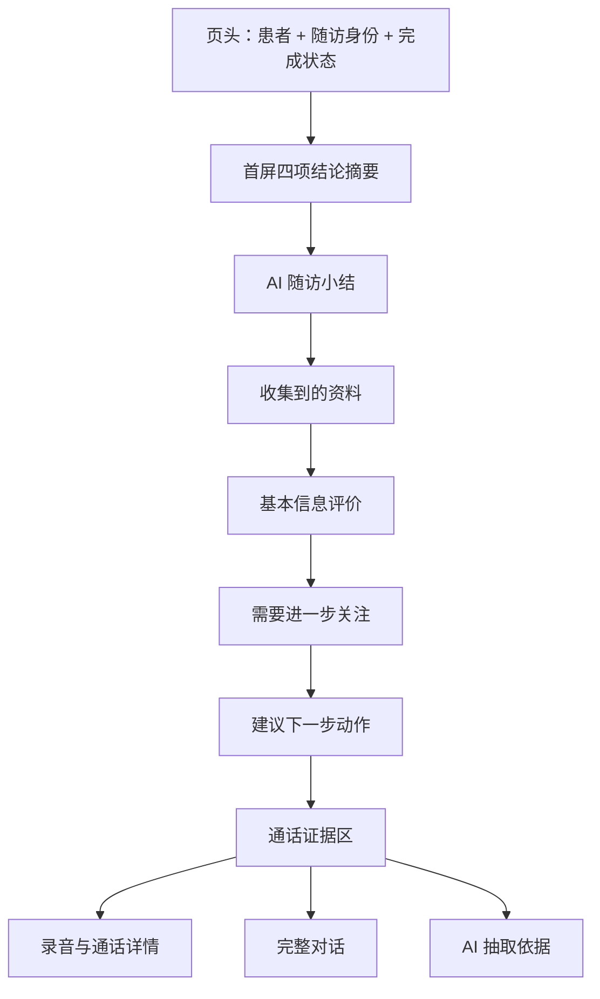

# AI 语音随访结果详情页 Demo PRD

| 项目项 | 内容 |
| --- | --- |
| 文档版本 | v0.1 讨论稿 |
| 提交日期 | 2026-07-15 |
| 产品定型 | 商业化产品 × 业务型管理软件 × 模块级静态 Demo |
| 展示对象 | 山东地区医疗机构管理者、慢病管理负责人、健管师 |
| 本期范围 | 一名糖尿病患者的一次 AI 语音随访结果详情 |
| 设计方向 | A：业务结论先行 |

## PRD 修改记录

| 变更时间 | 变更内容 | 版本号 |
| --- | --- | --- |
| 2026-07-15 | 根据现有智能外呼规划、两份阿里云外呼结果 Excel 和参考截图形成初稿 | v0.1 |

---

## 1、项目背景

### 1.1 业务背景

慢病管理系统已规划接入 AI 语音随访能力，目标不是只完成电话拨打，而是形成以下业务闭环：


现有参考页面分别解决了“传统随访表单展示”和“通话记录查看”，但 Demo 需要把二者整合成一页，并进一步回答三个业务问题：

1. 这次电话随访得到了什么结论？
2. 哪些信息需要健管师进一步关注？
3. AI 的判断是否有原始通话证据可以追溯？

### 1.2 Demo 定位

本 Demo 是面向客户展示的 Web 端静态页面，不是通义晓蜜控制台的复刻，也不是完整的外呼任务管理系统。

一句话定位：

> 将一次 AI 电话通话自动转化为“可阅读、可判断、可追溯、可行动”的糖尿病随访记录。

---

## 2、需求基本情况

| 要素 | 内容 |
| --- | --- |
| 需求提出角色 | 产品/售前团队 |
| 直接使用角色 | 健管师、家庭医生、慢病管理专员 |
| 决策观看角色 | 医疗机构管理者、慢病管理负责人、信息化负责人 |
| 核心场景 | 用户从患者随访记录进入本次 AI 语音随访详情，快速判断患者近况和后续动作 |
| 核心痛点 | 原始通话信息冗长，标签分散，健管师仍需手工听录音、读全文、整理随访小结 |
| 核心价值 | 把 2 分 38 秒、12 轮自然对话转成结构化结论、风险提醒和人工跟进任务，并保留录音与原文证据 |

### 2.1 核心用户任务

健管师进入页面后，应按以下顺序完成判断：

1. 10 秒内确认随访是否完成、患者是否安全、是否需要跟进。
2. 30 秒内读懂血糖监测、饮食、运动、用药、症状和跟进意愿。
3. 对可疑或低置信度结论，一键定位到对应通话原文。
4. 明确下一步应核实和处理的事项。

---

## 3、展示策略与方案选择

### 3.1 方案结论

采用 A「业务结论先行」，信息顺序为：

```text
患者与随访身份
→ 一屏结论摘要
→ AI 随访小结
→ 收集到的资料
→ 基本信息评价
→ 需要进一步关注的点
→ 建议下一步动作
→ 通话录音、完整对话和抽取证据
```

### 3.2 选择理由

- 客户首先看到业务价值，而不是通话技术参数。
- 健管师首先看到异常、疑点和下一步，不必先读完整对话。
- 通话录音和原文作为证据层存在，保证 AI 结果可追溯。
- 一次随访也能完整讲清“采集—判断—行动—PDCA”的产品故事。

### 3.3 不采用的方案

| 方案 | 不作为主方案的原因 | 可吸收部分 |
| --- | --- | --- |
| 通话与结果左右对照 | 通话技术信息容易抢占页面主视觉，弱化管理提效 | 在页面下半部分保留左右对照的证据区 |
| 传统长表单 | 与既有业务页面一致，但难以突出 AI 提炼与行动闭环 | 收集资料区沿用清晰的表单字段表达 |

---

## 4、项目收益目标

### 4.1 展示目标

| 目标 | 页面应传达的能力 | 验收判断 |
| --- | --- | --- |
| 功能完整 | 状态、录音、对话、标签、摘要、评价、关注点、建议动作均可见 | 客户能说出完整的结果回收链路 |
| 糖尿病贴合 | 覆盖血糖监测、饮食、运动、用药、低血糖症状和人工跟进 | 页面不能像通用客服通话详情 |
| 管理提效 | 先显示结论和待办，再提供证据 | 首屏无需读对话即可判断下一步 |
| AI 可信 | 每项结论区分患者自述、模型标签和待核实内容 | 低置信度结论有明显提示及证据入口 |
| 医疗安全 | 不做诊断和调药，不让 AI 自动修改干预方案 | 页面明确标注“AI 辅助，需专业人员确认” |

### 4.2 Demo 成功标准

1. 首屏同时展示“随访完成、近期空腹血糖偏高、发现疑似低血糖表现、需要重点人工跟进”四个核心判断。
2. 糖尿病管理六类关键信息在一个结构化区域内完整呈现。
3. 任一 AI 结论最多一次点击即可查看对应对话证据。
4. 客户能清楚理解 AI 不是替代健管师，而是减少听录音、读全文和手工整理的时间。

---

## 5、山东糖尿病患者演示案例

> 本案例为脱敏虚构案例。字段结构参考用户提供的外呼结果样例，具体患者身份、指标、症状、对话和机构均为强化展示效果而构造，不代表真实患者、真实客户实施结果或医疗结论。

### 5.0 案例亮点设计

本案例不选择“各项正常”的平淡通话，而是用一次 2—3 分钟电话同时展示六项产品优势：

| 产品优势 | 案例中的体现 |
| --- | --- |
| 个性化随访 | 机器人结合系统中近期空腹血糖记录和患者管理目标提问 |
| 自然对话采集 | 患者用口语同时描述饮食、运动、漏服药和身体不适，AI 自动拆分归类 |
| 风险信号识别 | 从“心慌、出汗，吃东西后缓解”中识别疑似低血糖表现，并标记待核实 |
| 执行障碍洞察 | 不只标记“未运动”，还识别出连续降雨和膝部不适两个障碍 |
| 医疗安全边界 | 患者询问是否减药时，机器人不直接回答调药，转为人工跟进 |
| 管理闭环提效 | 自动生成当日健管师重点待办，并能从结论回溯到原始对话 |

### 5.1 案例身份

| 字段 | Demo 内容 |
| --- | --- |
| 患者 | 刘秀兰（演示姓名） |
| 性别/年龄 | 女，63 岁 |
| 管理病种 | 2 型糖尿病 |
| 管理年限 | 9 年 |
| 本次随访 | 第 4 周糖尿病管理计划复盘 |
| 触发原因 | 系统记录显示近期 3 次空腹血糖高于该患者当前个体化管理目标 |
| 随访方式 | AI 语音电话 |
| 随访时间 | 2026-07-13 15:26 |
| 联系号码 | 186****3721 |
| 机器人已知上下文 | 近期空腹血糖记录、当前饮食/运动/用药管理要求、上次随访摘要 |

### 5.2 原始通话事实

| 维度 | 结果 |
| --- | --- |
| 通话状态 | 已接通—正常完结 |
| 接听结果 | 本人接听 |
| 随访完成情况 | 已完成 |
| 通话时长 | 2 分 38 秒 |
| 整体呼叫时长 | 2 分 54 秒 |
| 振铃时长 | 16 秒 |
| 对话轮次 | 12 轮 |
| 挂断方 | 机器人 |
| 血糖监测 | 患者称近两天空腹血糖分别约 8.2、8.6 mmol/L；与系统近期记录方向一致 |
| 饮食执行 | 晚餐主食控制欠佳，近期常同时吃馒头和稀饭 |
| 运动执行 | 连续 5 天未完成餐后步行；患者提到下雨和膝部不适 |
| 用药依从性 | 上周有 2 次晚餐后忘记服药 |
| 风险症状 | 昨日午餐前出现心慌、出汗，未测血糖；吃饼干后约 10 分钟缓解 |
| 患者追问 | “是不是药吃多了，要不要减一点？” |
| 机器人处理 | 明确不建议自行调药，记录疑似风险信号并转健管师/医生进一步确认 |
| 人工跟进 | 患者希望当日 15:00 后联系；标记为“重点跟进” |

### 5.3 页面展示用 AI 随访小结

> 患者本人接听并完成随访。患者自述近两天空腹血糖约 8.2、8.6 mmol/L，近期晚餐主食控制欠佳，连续 5 天未完成餐后步行，上周有 2 次晚餐后漏服药。患者昨日午餐前曾出现心慌、出汗，未测血糖，进食后缓解，属于疑似低血糖表现，需专业人员进一步核实。患者询问是否需要减药，机器人未提供调药建议，并已记录当日 15:00 后由健管师重点跟进。

### 5.4 风险表达分层

为避免把一次已缓解的不适直接包装成确诊风险，页面必须区分：

| 风险层 | 结论 | 含义 |
| --- | --- | --- |
| 当前紧急状态 | 暂未报告当前持续不适 | 患者描述的是昨日已缓解事件；仍需人工确认，不等同于排除风险 |
| 疑似风险信号 | 疑似低血糖表现，待核实 | 心慌、出汗、进食后缓解，但当时未测血糖，AI 不下诊断结论 |
| 慢病管理关注度 | 高度关注 | 近期血糖偏高、漏服药、饮食与运动执行困难并存，且患者主动询问调药 |

---

## 6、项目范围

### 6.1 本期包含

- 单次 AI 语音随访结果详情页。
- 以静态数据模拟“机器人已接入患者近期指标和管理计划上下文”的目标态能力。
- 默认展示健管师已触发“智能提炼”后的完成态，不在本页演示模型生成过程。
- 脱敏患者基本信息。
- 通话状态和关键通话指标。
- AI 随访小结。
- 糖尿病随访结构化资料。
- 基本信息评价。
- 需要进一步关注的点。
- 建议动作与模拟创建待办。
- 录音播放器的静态/模拟交互。
- 完整对话、关键证据和字段来源追溯。
- 医疗安全与 AI 结果边界提示。

### 6.2 本期不包含

- 外呼任务列表、批次统计和多患者管理。
- 多次随访历史趋势。
- 真实阿里云接口、真实录音下载或播放。
- 真实待办写入、短信发送、导出和权限后端。
- 真实患者数据或真实医疗机构名称。
- AI 自动调整药物、诊断疾病或直接修改干预方案。
- 移动端适配。

### 6.3 与现有迭代规划的关系

- 现有一期规划优先跑通固定糖尿病场景、结果回收和健管师手动触发关键点提炼。
- 本 Demo 为了完整体现产品优势，会静态模拟规划中的“患者上下文个性化随访”目标态。
- Demo 仅用于产品方案和售前展示，不应对外表述为已经上线的真实客户能力或真实实施效果。

---

## 7、信息架构

### 7.1 页面整体结构



### 7.2 首屏布局

推荐页面基准宽度 1440px，内容区最大宽度 1280px。

| 区域 | 布局 | 内容 |
| --- | --- | --- |
| 顶部页头 | 单行通栏 | 返回、患者、病种、随访名称、完成状态、查看患者档案 |
| 结论摘要 | 四列卡片 | 本人接听、近期血糖偏高、疑似风险信号、重点跟进 |
| 主内容 | 左 2/3 | AI 小结、收集资料、基本评价、进一步关注 |
| 行动侧栏 | 右 1/3，首屏可见 | 建议动作、处理时限、模拟创建健管师待办 |
| 通话证据 | 页面下半部分通栏 | 播放器、通话参数、对话和抽取证据 |

### 7.3 阅读优先级

| 优先级 | 信息 | 视觉策略 |
| --- | --- | --- |
| P0 | 是否完成、是否存在疑似风险信号、是否需要重点人工跟进 | 首屏大卡片、状态色和短结论 |
| P1 | 血糖、依从性、风险症状、执行障碍、患者意愿 | 结构化资料和评价卡片 |
| P2 | 录音、对话全文、任务 ID、线路参数 | 下半部分证据区，默认收敛 |

---

## 8、视觉与状态规范

### 8.1 风格方向

- 严格延续截图中的慢病管理 Web 风格：浅灰工作区、白色内容卡、亮蓝主色、细边框和轻量阴影。
- 不复刻阿里云控制台；通话信息只保留对业务有价值的字段。
- 页面语气专业、克制、可信，不使用深色背景、AI 炫光、大面积渐变或玻璃拟态。
- 蓝色只承担导航、选中、可点击和 AI 辅助信息；风险颜色只用于风险，不让页面变成“彩色仪表盘”。
- 卡片内使用截图同类的左侧蓝色短竖线作为模块标题锚点；患者详情标签页使用蓝色文字和 3px 蓝色下划线表示当前页。

### 8.2 状态色

| 语义 | 色值 | 使用方式 |
| --- | --- | --- |
| 页面工作区 | `#F3F5F7` | 页面背景、卡片之间的留白 |
| 卡片/输入底色 | `#FFFFFF` | 内容卡、抽屉、对话区和侧栏 |
| 主色/选中 | `#2589F5` | 顶部标签、主按钮、模块标题竖线、可点击文字 |
| 主色浅底 | `#EAF4FF` | AI 提炼标识、选中项、轻提示底色 |
| 边框/分割线 | `#E6EBF1` | 卡片边框、页签下边线、表格分隔 |
| 主文字/次文字 | `#303133` / `#7A8493` | 标题、正文、辅助信息 |
| 正常/完成 | `#18B566` | 已完成、本人接听、当前未报告持续不适 |
| 需关注 | `#FAAD14` | 空腹血糖偏高、漏服药、运动困难、待核实 |
| 高风险/重点处理 | `#F5222D` | 疑似低血糖表现、调药疑问、重点人工跟进 |
| 未知/未收集 | `#A8B1BC` | 不完整或未采集的信息 |

### 8.3 组件视觉规则

| 组件 | 视觉规则 |
| --- | --- |
| 页面背景 | 浅灰工作区；内容卡 16px 间距，不使用大面积色块分区 |
| 内容卡 | 白底、1px `#E6EBF1` 边框、4px 圆角、轻微阴影或无阴影 |
| 模块标题 | 18px 半粗体，标题前使用 3px × 20px 蓝色短竖线 |
| 四项结论卡 | 白底为主；仅在状态图标、数字、标签和顶部细色条使用语义色 |
| 主按钮 | `#2589F5` 实底白字，4px 圆角；次按钮白底蓝边蓝字 |
| 页签 | 常规深灰字；当前项蓝字 + 蓝色下划线；不使用胶囊式全填充 Tab |
| 表格/资料项 | 行间用细分割线；来源与可信度使用小号浅底标签，不用重色块 |
| 风险提示 | 红色仅放在风险图标、标题与左侧细边；提示底色使用极浅红 `#FFF1F0` |

### 8.3 可信度表达

结构化字段需显示来源和确认状态：

- `患者自述`：直接来自患者原话。
- `AI 归纳`：模型基于多轮对话归纳。
- `待核实`：原话不足或模型标签与证据不完全一致。
- `系统事实`：通话时长、状态、轮次等系统数据。

---

## 9、核心内容设计

### 9.1 页头

**页面标题：** AI 语音随访结果详情

**副标题：** 刘秀兰 · 第 4 周糖尿病管理计划复盘 · 2026-07-13 15:26

**状态：** 已完成

**患者信息展示边界：** 仅展示患者姓名、性别、年龄/出生日期、管理病种和必要标签；不展示组织归属、地域/地址或完整手机号。

**操作：**

| 操作 | Demo 行为 |
| --- | --- |
| 返回 | 返回按钮仅做视觉反馈 |
| 查看患者档案 | 打开静态抽屉，展示基础档案摘要 |
| 复制随访小结 | 复制文本并显示成功提示 |

### 9.2 首屏结论摘要

| 卡片 | 主信息 | 辅助信息 | 状态 |
| --- | --- | --- | --- |
| 接听情况 | 本人接听 | 2 分 38 秒 · 12 轮对话 | 正常 |
| 血糖情况 | 近期空腹偏高 | 自述约 8.2、8.6 mmol/L，与系统记录方向一致 | 需关注 |
| 风险信号 | 疑似低血糖表现 | 昨日心慌、出汗，进食后缓解；当时未测血糖 | 重点核实 |
| 后续处理 | 重点跟进 | 患者询问调药，并指定当日 15:00 后联系 | 需行动 |

### 9.3 AI 随访小结

包含：

- 一段 100—160 字的结论摘要。
- `AI 已提炼`标识。
- “内容由 AI 基于通话生成，请结合原始记录核实”提示。
- “查看提炼依据”入口，定位到证据区。
- “复制小结”操作。

### 9.4 收集到的资料

| 资料类别 | 结果 | 来源/可信度 | 证据操作 |
| --- | --- | --- | --- |
| 身份确认 | 本人接听 | 患者自述 · 高 | 查看原话 |
| 近期血糖记录 | 空腹约 8.2、8.6 mmol/L | 患者自述 + 系统记录 · 高 | 对照记录 |
| 血糖趋势判断 | 高于该患者当前管理目标 | 系统规则 · 高 | 查看目标 |
| 饮食执行 | 晚餐主食控制欠佳 | 患者自述 · 高 | 查看原话 |
| 运动执行 | 连续 5 天未完成餐后步行 | 患者自述 · 高 | 查看原话 |
| 用药依从性 | 上周漏服 2 次 | 患者自述 · 高 | 查看原话 |
| 风险症状 | 昨日心慌、出汗，进食后缓解 | 患者自述 · 高 | 查看原话 |
| 风险判断 | 疑似低血糖表现，待专业人员核实 | AI 归纳 · 中；缺少当时血糖值 | 查看依据 |
| 执行障碍 | 连续降雨、膝部不适 | AI 归纳 · 高 | 查看原话 |
| 患者追问 | 是否需要减药 | 患者自述 · 高 | 查看安全应答 |
| 人工跟进 | 当日 15:00 后重点联系 | 患者意愿 · 高 | 查看原话 |

### 9.5 基本信息评价

本模块名称保留用户要求的“基本信息评价”，但内容应是 AI 辅助的管理评价，不是医疗诊断。

| 评价维度 | 评价结果 | 说明 |
| --- | --- | --- |
| 当前状态 | 通话时未报告持续不适 | 不代表对昨日症状已完成医学评估 |
| 血糖管理 | 近期空腹血糖高于该患者当前管理目标 | 患者自述与系统记录可交叉核对 |
| 生活方式依从性 | 偏弱 | 晚餐主食控制欠佳，连续 5 天未完成餐后步行 |
| 用药依从性 | 存在漏服 | 上周有 2 次晚餐后忘记服药，需核实原因和后续处理 |
| 风险信号 | 疑似低血糖表现，待核实 | 当时未测血糖，AI 只提醒、不下诊断结论 |
| 服务接受度 | 良好 | 患者完成随访并主动指定方便联系的时间 |

### 9.6 需要进一步关注的点

按“先核实信息，再处理障碍”的顺序展示：

| 优先级 | 关注点 | 原因 | 建议动作 |
| --- | --- | --- | --- |
| P0 | 核实昨日心慌、出汗事件 | 存在疑似低血糖表现，但当时未测血糖 | 由健管师/医生进一步确认；若患者当前再次不适，按机构既有安全流程处理 |
| P0 | 处理患者调药疑问 | 患者主动询问是否减药 | 不由 AI 回答调药，转专业人员评估 |
| P1 | 核实漏服原因和近期用药情况 | 上周漏服 2 次 | 完成用药信息核对，不在 Demo 中给补服或调药方案 |
| P1 | 跟进饮食与运动障碍 | 晚餐主食偏多，雨天和膝部不适影响运动 | 了解可调整的管理方式，形成更可执行的后续目标 |
| P1 | 复核近期血糖记录 | 患者自述与系统记录均提示近期偏高 | 由健管师结合患者档案进行专业判断 |

### 9.7 建议下一步动作

右侧行动卡默认展示：

- 动作：创建“糖尿病风险信号重点跟进”待办。
- 负责人：当前患者所属健管师。
- 建议完成时间：2026-07-13 17:00 前（Demo 规则）。
- 患者方便联系时间：15:00 后。
- 待办摘要：核实昨日不适事件；处理调药疑问；核对漏服和近期血糖；跟进饮食与运动障碍。

点击“创建健管师待办”后，静态 Demo 弹出确认框；确认后按钮变为“已创建”，并显示成功提示，不真实写入数据。

---

## 10、通话证据区

### 10.1 分区结构

使用三个页签：

1. **通话详情**：录音播放器、状态和关键参数。
2. **完整对话**：机器人与患者的 12 轮对话。
3. **AI 抽取依据**：结构化字段与原文片段的对应关系。

### 10.2 通话详情字段

| 字段 | 展示值 |
| --- | --- |
| 通话状态 | 已接通—正常完结 |
| 计划呼出时间 | 2026-07-13 15:25:45 |
| 实际呼出时间 | 2026-07-13 15:26:01 |
| 振铃时长 | 16 秒 |
| 通话时长 | 2 分 38 秒 |
| 整体呼叫时长 | 2 分 54 秒 |
| 交互轮次 | 12 轮 |
| 挂断方 | 机器人 |
| 主叫号码 | 0531****8210 |
| 被叫号码 | 186****3721 |
| 系统作业 ID | 默认折叠，展开后展示 |
| 本次通话 ID | 默认折叠，展开后展示 |

播放器为 Demo 模拟控件，支持播放/暂停、进度拖动、倍速和音量视觉反馈；无真实音频时显示“演示音频”。

### 10.3 完整对话展示

- 左侧为 AI 机器人，右侧为患者，沿用参考截图的对话气泡结构。
- 每轮展示时间点。
- 对患者打断位置增加“被打断”小标识，体现自然对话处理能力。
- 与重要结论相关的原话使用轻量高亮：空腹血糖八点多、晚餐主食偏多、连续几天没走路、漏服药、心慌出汗、询问减药、指定联系时间。
- 点击任一高亮原话，可在右侧显示它支持的结构化字段。

建议在对话中重点呈现以下“亮点片段”，完整对话可围绕这些内容补齐：

1. **上下文个性化**：机器人说明“看到您最近几次空腹血糖比当前管理目标高一些”，再询问近期情况。
2. **口语化信息拆分**：患者一次回答中提到“晚饭馒头稀饭都吃、下雨没出去走、晚饭后的药忘过两次”，AI 自动拆成饮食、运动、用药三类字段。
3. **风险追问**：患者说“昨天晌午前心慌、出汗”，机器人追问是否测血糖、是否缓解、目前是否仍不适。
4. **安全边界**：患者问“药是不是吃多了，要不要减一点”，机器人明确不能建议自行调药，并记录人工联系需求。
5. **预约式转人工**：机器人询问方便联系时间，患者回答“下午三点以后都行”。

### 10.4 AI 抽取依据

| 结构化结论 | 对话证据 | 处理方式 |
| --- | --- | --- |
| 近期空腹血糖偏高 | “这两天早晨都是八点多，昨天 8.2，今天 8.6。” | 患者自述；与系统记录方向一致 |
| 晚餐主食控制欠佳 | “馒头和稀饭有时候都吃，晚上容易饿。” | 患者自述，确认 |
| 运动未执行 | “下了几天雨，膝盖也不得劲，五六天没出去走了。” | AI 拆分为运动未执行 + 天气/膝部不适障碍 |
| 存在漏服 | “晚饭后那回药，上周忘了两次。” | 患者自述，确认 |
| 疑似低血糖表现 | “昨天晌午前心慌、出汗，没测，吃了两块饼干一会儿好了。” | AI 归纳；因无当时血糖值，必须标记待核实 |
| 调药疑问 | “是不是药吃多了，要不要减一点？” | 触发安全边界，不给调药建议 |
| 重点人工跟进 | “下午三点以后都行，让健管师给我打吧。” | 患者明确意愿和时间偏好 |

该区域是 Demo 的核心可信度亮点：既能把一段口语回答拆成多个管理字段，又不会把“疑似低血糖表现”直接包装成诊断事实，而是同时展示结论、证据、缺口和人工确认边界。

---

## 11、关键交互

| 交互 | 触发 | 结果 |
| --- | --- | --- |
| 查看原话 | 点击结构化资料的“查看原话” | 滚动到对话页签并高亮对应语句 |
| 查看风险依据 | 点击“疑似低血糖表现” | 展示原话、缺失的当时血糖值和“待专业人员核实”说明 |
| 切换证据页签 | 点击通话详情/完整对话/AI 抽取依据 | 切换静态内容区域 |
| 播放录音 | 点击播放 | 模拟进度播放，不加载真实音频 |
| 展开技术参数 | 点击“更多通话信息” | 展示 ID、线路时长等次要字段 |
| 复制小结 | 点击复制 | 显示“随访小结已复制”提示 |
| 创建待办 | 点击按钮并确认 | 显示“已创建”状态，不真实写入 |
| 查看患者档案 | 点击页头操作 | 打开右侧抽屉展示脱敏基础档案 |

---

## 12、AI 可靠性、医疗边界与隐私

### 12.1 人机边界

| 内容 | AI 可执行 | 必须人工确认 |
| --- | --- | --- |
| 通话转写 | 是 | 对关键误识别可人工查看原文 |
| 标签提取 | 是 | 低置信度或证据不足的标签 |
| 随访小结 | 是 | 正式写入或用于管理决策前确认 |
| 关注点建议 | 是 | 是否创建任务及如何跟进 |
| 诊断、调药、治疗建议 | 否 | 必须由医生或具备相应资质的人员处理 |
| 自动修改干预方案 | 否 | 仅形成建议，不自动生效 |

### 12.2 页面固定提示

> 本页内容由 AI 基于通话记录辅助生成，仅用于健康管理随访信息整理，不构成诊断或治疗建议。请结合患者档案和专业判断进行确认。

### 12.3 隐私规则

- 患者姓名和手机号在 Demo 中使用虚构或脱敏信息。
- 默认不展示完整主叫、被叫号码。
- 默认不展示完整系统任务 ID。
- 不在页面中出现真实录音 URL、密钥或客户内部标识。

---

## 13、数据来源映射

### 13.1 呼叫流水 Excel

| Excel 字段 | 页面位置 |
| --- | --- |
| 作业状态、状态、对话完结、挂断原因 | 通话状态 |
| 计划呼出时间、实际呼出时间 | 通话详情 |
| 通话时长、线路通话时长、整体通话时长 | 结论摘要和通话详情 |
| 交互轮次 | 结论摘要和通话详情 |
| 接听结果、随访完成情况 | 结论摘要和结构化资料 |
| 血糖监测、饮食、运动、用药 | 收集到的资料 |
| 风险信号、执行障碍、人工跟进需求 | 评价、进一步关注、建议动作 |
| 录音 ID | 播放器演示数据 |
| 对话记录 | 完整对话和 AI 抽取依据 |
| JobID、TaskID | 更多通话信息 |

### 13.2 任务结果 Excel

任务结果中的任务信息、接通率、完成率、通话时长分布等属于批次/任务统计。本 Demo 只展示一次随访结果，因此仅使用其中的场景名称、外呼策略和单次统计事实做背景，不在详情页展示批次图表。

---

## 14、Demo 演示脚本与验收标准

### 14.1 建议演示脚本（约 3 分钟）

1. **先看结果**：指出患者本人完成随访，近期空腹血糖偏高，发现一条疑似低血糖表现，并需要当日重点人工跟进。
2. **再看个性化**：展示机器人不是机械问卷，而是结合系统里的近期血糖和当前管理目标发起追问。
3. **展示自然对话采集**：一段口语回答被自动拆成饮食、运动、用药和执行障碍多个字段。
4. **强调医疗安全**：患者询问是否减药时，机器人没有越界回答，而是记录问题并转专业人员处理。
5. **强调 AI 可信度**：点击“疑似低血糖表现”，展示支持原话、缺失的当时血糖值和“待核实”标记。
6. **强调管理提效**：展示系统已将症状核实、调药疑问、漏服、饮食运动障碍和联系时间整理为当日待办。
7. **最后看证据**：进入通话对话，说明任何结论均可追溯到录音和原文。

### 14.2 页面验收标准

- [ ] 仅展示一名患者的一次 AI 语音随访。
- [ ] 1440×900 首屏可见四项结论摘要、AI 小结和下一步动作。
- [ ] 糖尿病结构化资料至少覆盖血糖、饮食、运动、用药、风险症状、执行障碍、患者追问和人工跟进。
- [ ] 页面同时展示系统已有上下文、患者自述、AI 归纳和待核实内容。
- [ ] “当前未持续不适”“疑似风险信号”和“需要重点跟进”分层表达。
- [ ] 疑似低血糖表现不得显示为确诊结论，必须展示缺失的当时血糖值和人工确认要求。
- [ ] 患者调药问题必须触发安全边界，不出现 AI 调药建议。
- [ ] 每个核心结论有来源标签；重点结论可定位到对话证据。
- [ ] 录音播放器、页签、展开、复制和创建待办具备静态交互反馈。
- [ ] 页面包含 AI 医疗边界和隐私提示。
- [ ] 页面不包含任务列表、批次统计和多次随访趋势。

### 14.3 后续讨论项

以下事项不阻塞 v0.1 PRD，可在开工前确认：

1. 患者演示姓名是否继续使用“刘秀兰”，还是换成其他虚构姓名。
2. 机构口径使用“济南市某社区卫生服务中心”，还是换成山东某地市级慢病管理中心。
3. 基本信息评价模块是否保留“服务接受度”维度。
4. “创建健管师待办”是否需要展示确认弹窗，还是只显示建议动作。
5. Demo 是否需要一段可播放的合成演示音频；默认仅模拟播放器。

---

## 附：自检结果

| 自检项 | 结果 |
| --- | --- |
| 产品定位 | 已明确：面向医疗机构的单次 AI 语音随访结果展示 |
| 核心业务流程 | 已覆盖：通话回收—结构化—评价—关注—行动—证据 |
| 糖尿病场景贴合 | 已覆盖核心采集项和低血糖症状筛查 |
| AI 可靠性 | 已区分系统事实、患者自述、AI 归纳和待核实内容 |
| 医疗合规边界 | 已明确不诊断、不调药、不自动修改干预方案 |
| Demo 范围 | 已明确只展示一次结果，不扩展列表、统计和真实后端 |
| 主要缺口 | 仅剩演示姓名、机构口径、待办交互和音频形式等展示偏好 |
